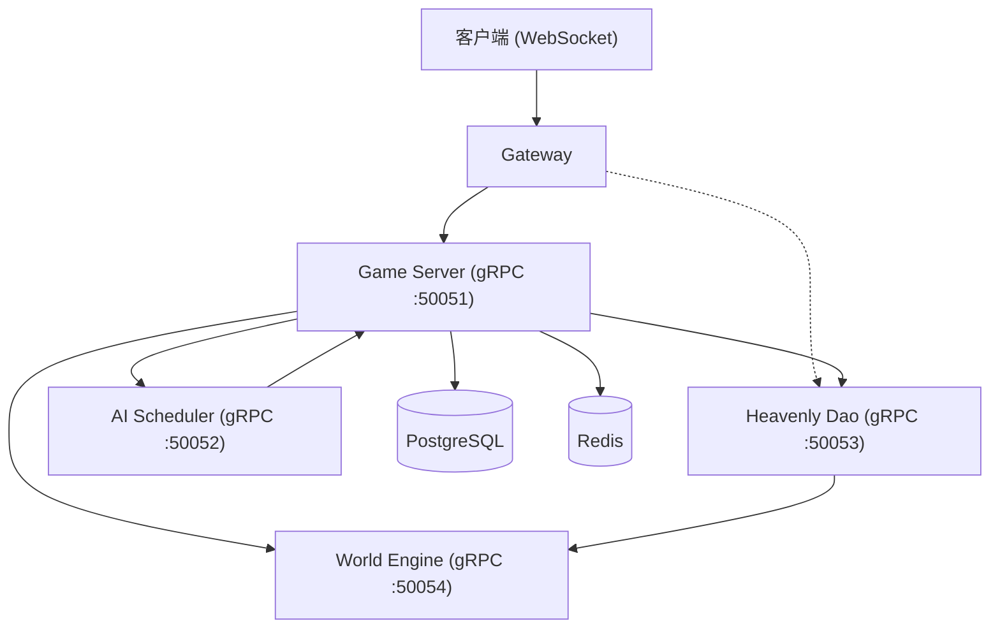

# 系统架构文档

## 整体架构

修仙世界采用微服务架构，由 5 个独立服务组成，通过 gRPC 进行服务间通信，客户端通过 WebSocket 连接到 Gateway 服务。



## 服务说明

### 1. Gateway (网关服务)

- **端口**: 8080 (HTTP/HTTPS + WebSocket)
- **职责**: 
  - 客户端 WebSocket 连接管理
  - HTTP REST API（注册、登录）
  - JWT 认证与 token 验证
  - 消息路由到 Game Server
  - WebSocket Hub 管理所有在线客户端
- **技术**: Gin + Gorilla WebSocket
- **入口**: `server/gateway/cmd/main.go`

### 2. Game Server (游戏服务器)

- **端口**: 50051 (gRPC)
- **职责**:
  - 实体（玩家/NPC）生命周期管理
  - 操作执行（修炼、移动、打坐、休息、突破）
  - 实体状态同步
  - 数据持久化（PostgreSQL）与缓存（Redis）
- **技术**: gRPC + pgx + go-redis
- **入口**: `server/game-server/cmd/main.go`

### 3. World Engine (世界引擎)

- **端口**: 50054 (gRPC)
- **职责**:
  - 区域管理（查询、初始化）
  - 资源生成与刷新
  - 世界事件触发
  - 世界状态维护与 Epoch 推进
  - 世界平衡指标监控
- **技术**: gRPC
- **入口**: `server/world-engine/cmd/main.go`

### 4. Heavenly Dao (天道服务)

- **端口**: 50053 (gRPC)
- **职责**:
  - 因果（Karma）评估与衰减
  - 天劫（Tribulation）触发与强度计算
  - 世界平衡检查与调整建议
  - 天道印记计算
- **技术**: gRPC
- **入口**: `server/heavenly-dao/cmd/main.go`

### 5. AI Scheduler (AI 调度器)

- **端口**: 50052 (gRPC)
- **职责**:
  - NPC 行为决策（行为树 + LLM）
  - NPC 注册/注销管理
  - 行为模板匹配
  - LLM API 调用限流
  - AI 动作生成与调度
- **技术**: gRPC + DeepSeek API
- **入口**: `server/ai-scheduler/cmd/main.go`

## 数据流

### 玩家操作流

```
Client -> WebSocket -> Gateway -> gRPC -> Game Server -> PostgreSQL/Redis
                                                      -> gRPC -> Heavenly Dao (Karma)
                                                      -> gRPC -> World Engine (Events)
Game Server -> WebSocket -> Gateway -> Client
```

### NPC 自主行为流

```
AI Scheduler -> 行为树匹配 / LLM 决策 -> 生成 Operation
         -> gRPC -> Game Server -> 执行操作
         -> Game Server -> 更新实体状态
```

### 天劫触发流

```
Game Server (突破操作) -> gRPC -> Heavenly Dao (CheckTribulation)
         <- 返回天劫概率、强度、类型
         -> 突破结果返回客户端
```

## 共享模块

### shared/types

核心类型定义，所有服务共享：

| 文件 | 说明 |
|------|------|
| `entity.go` | 实体、属性（83+ 字段）、境界、因果、状态 |
| `method.go` | 功法（60+ 字段）、技能、实体已学功法 |
| `item.go` | 物品模板、背包、装备、丹药、法宝、符箓、配方、材料 |
| `social.go` | 宗门、宗门成员、人际关系、NPC 性格、NPC 决策日志 |
| `world.go` | 区域、资源、区域规则、世界事件、世界状态、平衡指标 |
| `operation.go` | 操作类型（14 种）、操作、操作结果、验证结果 |
| `message.go` | WebSocket 消息类型（9 种）、消息体、认证/聊天/同步/错误载荷 |
| `id.go` | Entity ID 和 Operation ID 生成（16 字节随机十六进制） |

### shared/config

配置管理，支持 JSON 文件和环境变量两种方式加载：

- `DatabaseConfig`: PostgreSQL 连接配置
- `RedisConfig`: Redis 连接配置
- `ServerConfig`: HTTP 服务器配置
- `GRPCConfig`: gRPC 服务器配置
- `LLMConfig`: LLM API 配置（provider、API Key、模型、限流）
- `HeavenlyDaoConfig`: 天道配置（因果衰减率、天劫基础概率、境界寿命、因果阈值）

### shared/errors

错误码定义（10 种）和 `GameError` 类型，支持链式添加详细信息。

### shared/proto

Protocol Buffers 定义文件，生成 Go 代码到 `shared/proto/pb/` 目录。

## 数据库架构

### entities 表

| 字段 | 类型 | 说明 |
|------|------|------|
| id | string (PK) | 实体 ID |
| entity_type | string | 类型 (player/npc) |
| name | string | 名称 |
| realm | string | 境界 |
| region_id | string | 所在区域 |
| x | float64 | X 坐标 |
| y | float64 | Y 坐标 |
| status | string | 状态 |
| created_at | timestamp | 创建时间 |
| updated_at | timestamp | 更新时间 |

### base_attributes 表

| 字段 | 类型 | 说明 |
|------|------|------|
| entity_id | string (PK, FK) | 关联实体 ID |
| qi | float64 | 灵气值 |
| max_qi | float64 | 最大灵气 |
| spiritual_power | float64 | 灵力值 |
| max_spiritual_power | float64 | 最大灵力 |
| divine_sense | float64 | 神识 |
| comprehension | int | 悟性 |
| constitution | int | 体质 |
| luck | int | 运气 |
| cultivation_progress | float64 | 修炼进度 (0-100) |
| attack_power | float64 | 攻击力 |
| defense | float64 | 防御力 |
| speed | float64 | 速度 |
| mental_stability | int | 心智稳定度 |
| remaining_lifespan | int | 剩余寿命 |
| max_lifespan | int | 最大寿命 |

> 注：`base_attributes` 表当前存储 15 个基础属性。`types.Attributes` 中定义的 83+ 属性中，其余属性尚未在数据库层实现持久化。

## 部署架构

通过 Docker Compose 编排 6 个服务容器：

```
postgres (5432) + redis (6379) + gateway (8080) + 
game-server (50051) + heavenly-dao (50053) + 
ai-scheduler (50052) + world-engine (50054)
```

所有微服务共享同一 PostgreSQL 和 Redis 实例。
