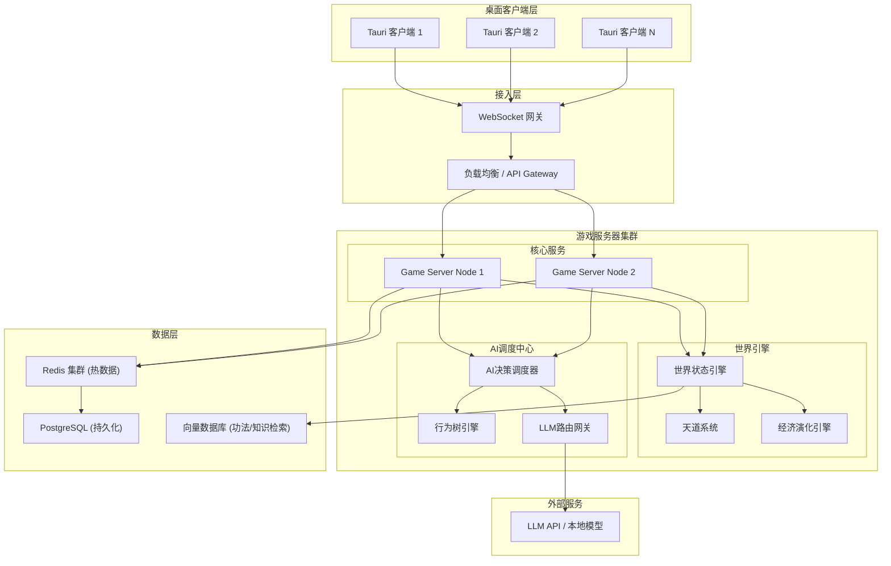
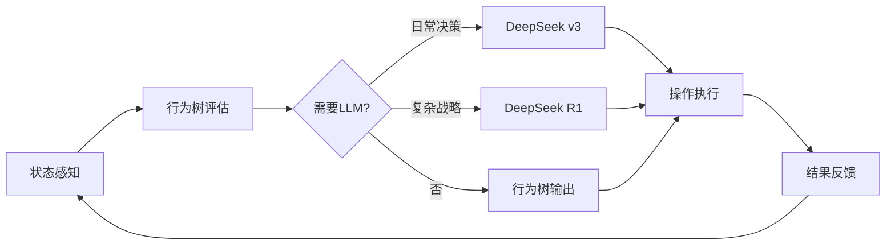

# 完全自主修仙第二世界 - 技术设计文档

Feature Name: autonomous-cultivation-npc
Updated: 2026-05-02

## Description

本项目是一个完全自主演化的多人在线文字MUD修仙世界，核心技术创新是NPC与现实玩家共享完全一致的操作接口，NPC通过混合AI系统（行为树 + LLM）自主决策，使得世界中每个实体都是自治个体。

世界特点：
- 无预设任务或剧情，所有行为由参与者自主决定
- 社会关系、经济体系、宗门势力完全自发演化
- 玩家/NPC可自创功法、炼丹配方、阵法
- 天道系统通过因果业力和天劫维持自然平衡

## Architecture



### 架构说明

| 层级 | 组件 | 职责 |
|------|------|------|
| 客户端 | Tauri + React | 桌面端界面，指令输入，世界信息渲染 |
| 接入层 | WebSocket 网关 | 连接管理，消息路由，会话维持 |
| 游戏服务器 | Go 微服务 | 核心游戏逻辑，操作验证，状态同步 |
| 世界引擎 | Go 服务 | 世界状态管理，天道判定，危机事件生成，**世界初始化** |
| AI调度 | Go 服务 | NPC决策调度，行为树执行，**第三方LLM API调用** |
| 数据层 | Redis + PostgreSQL + 向量库 | 热数据缓存，持久化存储，语义检索 |

**动态实体规模设计：**
- 服务器根据节点CPU/内存配置自动计算最大承载实体数
- 公式：`max_entities = (available_memory_mb / memory_per_entity) * cpu_factor`
- 当接近上限时，触发水平扩展或限制新NPC生成
- LLM API调用采用并发控制池，避免超过API速率限制

### 世界初始化引擎

```
WorldInitializer {
    load_template(template_name) -> WorldSeed
    generate_regions(seed) -> RegionGraph
    spawn_initial_npcs(count, distribution) -> list[Entity]
    place_resources(density, rarity_curve) -> ResourceMap
    establish_initial_factions() -> FactionGraph
    generate_world_lore() -> WorldHistory
    spawn_special_locations() -> SpecialLocations
}
```

**预置内容详细设计：**

1. **地图结构（区域层级）**
   ```
   世界根节点
   ├── 东荒域（主区域）
   │   ├── 青云镇（凡人城镇 - 新手起点）
   │   ├── 灵雾山脉（灵气山林 - 初级修炼地）
   │   ├── 黑风秘境（险地 - 中级探索）
   │   └── 落日沼泽（资源区 - 灵草/毒物）
   ├── 南岭域（主区域）
   │   ├── 赤炎城（修真城市）
   │   ├── 焚天谷（火属性灵地）
   │   └── 万兽山脉（妖兽聚集地）
   ├── 西漠域（主区域）
   │   ├── 黄沙古城（遗迹）
   │   └── 月牙绿洲（中立交易区）
   ├── 北原域（主区域）
   │   ├── 冰封神殿（高阶秘境）
   │   └── 雪原部落（散修聚落）
   └── 中州域（核心区域）
       ├── 天道城（世界中心）
       └── 天机阁（功法交易/传承地）
   ```

2. **灵气节点系统**
   - 灵气浓度分9品（1品最低，9品最高）
   - 每个区域有1-3个主要灵脉节点
   - 灵气浓度影响修炼效率和突破概率
   - 灵脉可被宗门占据或破坏

3. **初始NPC群体（50-100个）**
   - **修为分布**：
     - 炼气期：60%（30-60个）- 底层修士
     - 筑基期：25%（12-25个）- 中坚力量
     - 金丹期：10%（5-10个）- 区域强者
     - 元婴期：5%（2-5个）- 世界"锚点"，影响格局
   - **性格分布**：正道、中立、魔道、隐修等
   - **背景故事**：每个NPC有独特的出身、目标、恩怨关系
   - **初始行为倾向**：部分NPC已有初步势力或合作关系

4. **资源分布**
   - **灵草类**：不同品阶分布在不同灵气区域
   - **矿石类**：山脉、洞穴中分布
   - **妖兽**：各区域有不同等级妖兽，提供材料和威胁
   - **灵气泉眼**：稀有资源，可被占据

5. **初始宗门势力（2-3个）**
   - **青云宗**（正道）- 位于东荒域，收徒门槛低，理念"修身齐家"
   - **血煞殿**（魔道）- 位于南岭域，实力至上，理念"强者为尊"
   - **天机阁**（中立）- 位于中州域，功法交易、情报收集，理念"知识无价"

6. **世界历史与传说**
   - **上古大战**：万年前的正魔大战，留下多处遗迹
   - **陨落大能**：数位化神/渡劫大能陨落，遗留洞府和传承
   - **天道异变**：三百年前灵气潮汐，导致境界上限突破
   - **未解之谜**：若干隐藏线索供玩家/NPC探索发现

7. **基础规则设定**
   - 境界上限：初始设定为化神期（可通过世界演化突破）
   - 天劫规则：突破时有概率触发天劫
   - 死亡惩罚：身死道消，部分修为/物品掉落
   - 因果系统：善恶行为积累业力/功德

### LLM集成设计

**DeepSeek API 集成：**
- **模型选择**：
  - `deepseek-chat`（v3）：日常决策、对话生成（低延迟、高性价比）
  - `deepseek-reasoner`（R1）：复杂战略决策、功法自创验证（深度推理）
- **API兼容**：OpenAI兼容格式，可直接使用OpenAI SDK
- **成本控制**：NPC决策使用v3，关键剧情/复杂决策使用R1
- **速率限制**：DeepSeek限制600 RPM，需实现令牌桶限流

```
LLMProvider {
    provider: DeepSeekAPI
    models:
        daily: "deepseek-chat"        // 日常行为、对话
        reasoning: "deepseek-reasoner" // 复杂决策
    rate_limiter: TokenBucket(600/min)
    circuit_breaker: CircuitBreaker
    fallback: BehaviorTree
}

call_llm(context, priority) -> Decision:
    model = priority == HIGH ? reasoning : daily
    try:
        response = provider.generate(
            model=model,
            context=context,
            timeout=10s,
            max_tokens=500
        )
        return parse_decision(response)
    catch TimeoutError:
        metrics.record_fallback()
        return behavior_tree.decide(context)
    catch RateLimitError:
        metrics.record_throttle()
        wait(backoff_time)
        retry()
```

## Components and Interfaces

### 1. 统一操作接口 (Unified Action Interface)

所有实体（玩家和NPC）的操作都通过统一的命令接口执行：

```
Operation {
    actor_id: EntityID          // 执行者ID（玩家或NPC）
    action_type: ActionType     // 操作类型
    params: map<string, any>    // 操作参数
    timestamp: int64            // 时间戳
    signature: string           // 操作签名（用于回放）
}
```

**操作类型枚举：**

```
ActionType {
    CULTIVATE           // 修炼
    BREAKTHROUGH        // 突破境界
    COMBAT              // 战斗
    EXPLORE             // 探索
    GATHER              // 采集资源
    CRAFT               // 炼制（丹/器/阵）
    CREATE_METHOD       // 自创功法
    TRADE               // 交易
    FORM_SECT           // 创建宗门
    JOIN_SECT           // 加入宗门
    SEND_MESSAGE        // 发送消息
    CAST_SPELL          // 施法
    MEDITATE            // 打坐
    SLEEP               // 休息
    ...
}
```

### 2. 实体基类设计

```
Entity {
    id: EntityID
    entity_type: PLAYER | NPC
    name: string
    realm: CultivationRealm      // 境界
    attributes: Attributes       // 属性
    inventory: Inventory         // 背包
    methods: list[Method]        // 功法列表
    karma: Karma                 // 因果业力
    position: WorldPosition      // 位置
    status: EntityStatus         // 状态
}
```

**Player 和 NPC 继承同一基类，区别仅在于：**
- Player: input_source = CLIENT
- NPC: input_source = AI_AGENT

### 3. NPC AI 决策管道



**NPC系统提示词模板（DeepSeek）：**

```
你是一位修仙者，以下是你的角色设定：
- 姓名：{name}
- 境界：{realm}
- 性格：{personality}
- 背景：{background_story}
- 当前目标：{current_goal}
- 所属势力：{sect}

你身处一个完全自主的修仙世界，所有行为由你自主决定。
你可以修炼、探索、战斗、交易、结盟、背叛、自创功法等。
请根据当前情境做出符合角色设定的决策。

当前情境：
{context}

请从以下操作中选择一项：
{available_actions}

输出格式：
{
  "action": "操作类型",
  "params": {...},
  "reasoning": "决策理由（100字以内）"
}
```

**决策周期：**
- 高频行为树：每 1-5 秒评估一次（修炼、移动、简单交互）
- 低频LLM决策：每 30-120 秒评估一次（复杂社交、战略决策）
- LLM超时降级：超过 10 秒未响应则使用行为树默认策略

### 3.5 功法自创系统（含成本约束）

**成本约束设计：**
- 自创功法需要消耗 **10000极品灵石**，用于覆盖DeepSeek R1推理成本
- 防止NPC频繁调用LLM自创功法导致API费用失控
- 只有达到一定财富积累的实体才能尝试自创

```
CreateMethod {
    validate(entity) -> ValidationResult:
        if entity.spirit_stones.premium_grade < 10000:
            return Error("自创功法需要10000极品灵石")
        if entity.realm < required_realm:
            return Error("境界不足，无法自创功法")
        if entity.comprehension < required_comprehension:
            return Error("悟性不足，无法自创功法")
        return Success
    
    execute(entity, method_data) -> MethodEntity:
        entity.spirit_stones.premium_grade -= 10000
        method = deepseek_reasoner.validate_and_generate(method_data)
        method.creator_id = entity.id
        method.save()
        return method
}
```

**功法验证流程（DeepSeek R1）：**
1. 检查功法逻辑自洽性（属性加成是否合理）
2. 验证境界要求与效果匹配度
3. 生成功法描述、修炼路径、瓶颈设定
4. 返回结构化功法数据存入数据库

### 4. 世界状态引擎

```
WorldState {
    epoch: int64                   // 世界纪元时间
    realms: map<string, RealmState> // 各区域状态
    sects: map<string, SectState>   // 各宗门状态
    economy: EconomyState          // 经济状态
    events: list[WorldEvent]       // 进行中的事件
    balance_metrics: BalanceMetrics // 平衡指标
}
```

### 5. 天道系统

```
HeavenlyDao {
    evaluate_karma(entity) -> KarmicLevel
    check_heavenly_tribulation(entity) -> TribulationResult
    spawn_world_crisis() -> WorldEvent
    balance_check() -> BalanceAction
}
```

**因果业力类型：**
- 杀戮业力：击杀其他实体
- 功德：救助、传承、贡献
- 因果纠缠：恩怨、契约、承诺

### 6. 极品灵石严格获取机制

**设计原则：**
- 极品灵石是系统级稀缺资源，用于控制DeepSeek R1 API调用成本
- 严禁通过常规交易、修炼、采集等方式获取
- 只有通过重大世界贡献或突破才能获得

```
PremiumSpiritStoneSystem {
    // 允许的获取途径（硬编码，不可通过游戏内操作绕过）
    allowed_sources: [
        "heavenly_tribulation_breakthrough",  // 化神期天劫突破
        "world_secret_discovery",             // 首次发现隐藏传说/秘境
        "method_creator_reward",              // 自创功法被3+实体学习
        "world_crisis_resolution"             // 世界危机事件平息
    ]
    
    grant(entity_id, source, amount) -> Result:
        if source not in allowed_sources:
            return Error("非法获取途径")
        
        // 防重复领取检查
        if source == "heavenly_tribulation_breakthrough":
            if entity.has_claimed_breakthrough_reward(realm="nascent_soul"):
                return Error("已领取过突破奖励")
        
        if source == "method_creator_reward":
            method = get_method_by_creator(entity_id)
            if method.unique_learners < 10:
                return Error("学习人数不足10人")
        
        entity.premium_spirit_stones += amount
        record_premium_grant(entity_id, source, amount)
        return Success
}
```

**获取途径详细说明：**

| 途径 | 奖励范围 | 触发条件 | 频率限制 |
|------|----------|----------|----------|
| 化神期天劫突破 | 1-3 | 成功渡劫化神 | 每角色1次 |
| 发现隐藏传说/秘境 | 0-1 | 首次探索发现（仅极稀有发现） | 每传说/秘境1次 |
| 自创功法被学习 | 5-10 | 10个不同实体学习 | 每功法1次 |
| 平息世界危机 | 1-5 | 对危机事件有决定性贡献 | 每次危机1次 |

**获取难度分析：**
- 要积累10000极品灵石，需要：
  - 约3333-10000次化神突破（几乎不可能单人完成）
  - 或1000-2000个自创功法被广泛学习
  - 或2000-10000次世界危机决定性贡献
- 这意味着功法自创是极少数大能才能触及的领域
- NPC需要通过漫长的世界演化和积累才有可能获得

**全服极品灵石总量控制：**
- 初始总量：0（系统不预发）
- 年化产出上限：根据服务器实体数量动态计算
  - 公式：`annual_max = entity_count * 3`（假设每实体每年最多化神突破1次得3颗）

### 6.5 灵石体系与兑换比例

**灵石等级与兑换比例：**

```
1 极品灵石 = 10^11 上品灵石
1 上品灵石 = 10^9  中品灵石
1 中品灵石 = 10^4  下品灵石

因此：
1 极品灵石 = 10^20 中品灵石 = 10^24 下品灵石
```

**数据模型设计（使用BIGINT存储）：**

```sql
-- 灵石资产表（分离存储各级灵石，避免精度问题）
CREATE TABLE entity_spirit_stones (
    entity_id UUID PRIMARY KEY REFERENCES entities(id),
    low_grade BIGINT DEFAULT 0,     -- 下品灵石 (最多 2^63-1 ≈ 9×10^18)
    medium_grade BIGINT DEFAULT 0,  -- 中品灵石
    high_grade BIGINT DEFAULT 0,    -- 上品灵石
    premium_grade BIGINT DEFAULT 0  -- 极品灵石
);
```

**设计说明：**
- 各级灵石独立存储，不自动兑换
- 玩家/NPC可通过交易接口手动兑换（需支付手续费）
- 功法自创消耗的是极品灵石（10000颗），不可用其他等级灵石替代
- 日常交易主要使用中品/下品灵石，上品灵石已属珍贵，极品灵石为战略级资源
- 当全服极品灵石总量超过阈值时，天道系统自动降低后续奖励

### 7. 经济演化引擎

```
EconomyEngine {
    track_transaction(tx) -> void
    get_market_price(item) -> PriceEstimate
    detect_manipulation() -> ManipulationAlert
    adjust_resource_spawn() -> ResourceAdjustment
}
```

**无系统定价，价格完全由交易历史推导：**
- 使用移动平均线 + 供需比计算参考价
- 不干预交易，仅记录和分析

## Data Models

### 1. 角色数据模型

```sql
-- 实体表
CREATE TABLE entities (
    id UUID PRIMARY KEY,
    entity_type VARCHAR(10) NOT NULL CHECK (entity_type IN ('player', 'npc')),
    name VARCHAR(50) UNIQUE NOT NULL,
    realm VARCHAR(30) NOT NULL DEFAULT 'mortal',
    spiritual_root JSONB NOT NULL,  -- 灵根属性
    created_at TIMESTAMP DEFAULT NOW(),
    last_active_at TIMESTAMP,
    is_online BOOLEAN DEFAULT FALSE
);

-- 属性表
CREATE TABLE entity_attributes (
    entity_id UUID PRIMARY KEY REFERENCES entities(id),
    qi REAL DEFAULT 0,              -- 气血
    spiritual_power REAL DEFAULT 0, -- 灵力
    comprehension REAL DEFAULT 0,   -- 悟性
    constitution REAL DEFAULT 0,    -- 根骨
    luck REAL DEFAULT 0,            -- 气运
    cultivation_progress REAL DEFAULT 0  -- 修炼进度
);

-- 灵石资产表（独立存储各级灵石）
CREATE TABLE entity_spirit_stones (
    entity_id UUID PRIMARY KEY REFERENCES entities(id),
    low_grade BIGINT DEFAULT 0,     -- 下品灵石
    medium_grade BIGINT DEFAULT 0,  -- 中品灵石
    high_grade BIGINT DEFAULT 0,    -- 上品灵石
    premium_grade BIGINT DEFAULT 0  -- 极品灵石
);

-- 功法表
CREATE TABLE cultivation_methods (
    id UUID PRIMARY KEY,
    name VARCHAR(100) NOT NULL,
    creator_id UUID REFERENCES entities(id),
    realm_requirement VARCHAR(30),
    attributes JSONB,               -- 功法效果
    description TEXT,
    created_at TIMESTAMP DEFAULT NOW(),
    version INTEGER DEFAULT 1,
    parent_method_id UUID REFERENCES cultivation_methods(id)
);

-- 功法-实体关联
CREATE TABLE entity_methods (
    entity_id UUID REFERENCES entities(id),
    method_id UUID REFERENCES cultivation_methods(id),
    proficiency REAL DEFAULT 0,     -- 熟练度
    PRIMARY KEY (entity_id, method_id)
);
```

### 2. 世界状态数据模型

```sql
-- 区域表
CREATE TABLE world_regions (
    id UUID PRIMARY KEY,
    name VARCHAR(100) NOT NULL,
    parent_region_id UUID REFERENCES world_regions(id),
    spiritual_density REAL DEFAULT 0,  -- 灵气浓度
    spiritual_tier INTEGER DEFAULT 1,  -- 灵气品阶（1-9）
    danger_level INTEGER DEFAULT 0,    -- 危险等级
    resources JSONB,                    -- 资源分布
    rules JSONB,                        -- 区域规则（禁区等）
    description TEXT,                   -- 区域描述
    lore TEXT                           -- 区域传说/历史
);

-- 宗门表
CREATE TABLE sects (
    id UUID PRIMARY KEY,
    name VARCHAR(100) UNIQUE NOT NULL,
    founder_id UUID REFERENCES entities(id),
    philosophy TEXT,                    -- 宗门理念
    entry_requirements JSONB,           -- 入门条件
    territory JSONB,                    -- 势力范围
    rules JSONB,                        -- 宗门规则
    alignment VARCHAR(20),              -- 正道/魔道/中立
    created_at TIMESTAMP DEFAULT NOW()
);

-- 宗门成员表
CREATE TABLE sect_members (
    sect_id UUID REFERENCES sects(id),
    entity_id UUID REFERENCES entities(id),
    rank VARCHAR(30),                   -- 职位
    contribution REAL DEFAULT 0,        -- 贡献值
    joined_at TIMESTAMP DEFAULT NOW(),
    PRIMARY KEY (sect_id, entity_id)
);

-- 交易记录表
CREATE TABLE transactions (
    id UUID PRIMARY KEY,
    seller_id UUID REFERENCES entities(id),
    buyer_id UUID REFERENCES entities(id),
    item_id UUID,
    item_type VARCHAR(30),
    price REAL,
    currency VARCHAR(20) DEFAULT 'spirit_stone',
    created_at TIMESTAMP DEFAULT NOW()
);

-- 世界历史/传说表
CREATE TABLE world_lore (
    id UUID PRIMARY KEY,
    title VARCHAR(200) NOT NULL,
    category VARCHAR(30),               -- 大战/传说/遗迹/未解之谜
    content TEXT,                       -- 详细内容
    related_regions JSONB,              -- 关联区域
    related_entities JSONB,             -- 关联实体
    hints JSONB,                        -- 探索线索
    is_discovered BOOLEAN DEFAULT FALSE -- 是否已被发现
);

-- NPC关系网络表
CREATE TABLE npc_relationships (
    id UUID PRIMARY KEY,
    entity_a_id UUID REFERENCES entities(id),
    entity_b_id UUID REFERENCES entities(id),
    relationship_type VARCHAR(30),      -- 师徒/仇敌/盟友/恋人等
    strength REAL,                      -- 关系强度
    history TEXT,                       -- 关系历史
    created_at TIMESTAMP DEFAULT NOW()
);
```

### 3. NPC AI 数据模型

```sql
-- NPC人格配置
CREATE TABLE npc_personalities (
    npc_id UUID PRIMARY KEY REFERENCES entities(id),
    personality_type VARCHAR(30),      -- 性格类型
    moral_alignment VARCHAR(20),       -- 道德倾向
    ambition_level INTEGER,            -- 野心程度
    risk_tolerance REAL,               -- 风险承受度
    social_preference VARCHAR(20),     -- 社交偏好
    background_story TEXT,             -- 背景故事
    current_goal TEXT,                 -- 当前目标
    hidden_secrets JSONB,              -- 隐藏秘密
    llm_system_prompt TEXT,            -- DeepSeek系统提示词
    behavior_tree_config JSONB,        -- 行为树配置
    initial_actions JSONB              -- 初始行为模式
);

-- NPC决策日志
CREATE TABLE npc_decision_log (
    id UUID PRIMARY KEY,
    npc_id UUID REFERENCES entities(id),
    decision_type VARCHAR(30),
    context JSONB,                     -- 决策上下文
    action_taken JSONB,                -- 采取的行动
    reasoning TEXT,                    -- 决策推理（DeepSeek输出）
    model_used VARCHAR(20),            -- deepseek-chat / deepseek-reasoner
    source VARCHAR(10),                -- 'behavior_tree' | 'llm'
    token_cost REAL,                   -- API调用成本
    timestamp TIMESTAMP DEFAULT NOW()
);
```

## Correctness Properties

### 1. 操作一致性

**不变量：** 同一操作由玩家或NPC执行，系统验证逻辑完全相同。

```
forall op in Operations:
    validate(op, entity_type=PLAYER) == validate(op, entity_type=NPC)
```

### 2. 世界状态原子性

**不变量：** 每个操作执行后，世界状态保持一致性。

```
forall transaction:
    pre_state + transaction = post_state
    post_state satisfies all constraints
```

### 3. NPC决策可重现

**不变量：** 给定相同的种子和上下文，NPC行为树输出一致。

```
BehaviorTree.evaluate(context, seed) = deterministic_output
```

### 4. 因果系统无环

**不变量：** 因果业力计算不产生循环依赖。

```
karma_graph is a DAG (Directed Acyclic Graph)
```

### 5. 经济系统守恒

**不变量：** 交易系统遵循资源守恒（不考虑天道生成/销毁）。

```
sum(all_entities.resources) + sum(world.resources) = constant
```

## Error Handling

### 错误处理策略

| 错误类型 | 处理策略 | 用户/NPC反馈 |
|----------|----------|-------------|
| 操作验证失败 | 拒绝执行，返回错误码 | 玩家：提示信息；NPC：记录日志，重新决策 |
| LLM服务超时 | 降级到行为树 | 玩家：无感知；NPC：使用默认策略 |
| 数据库写入失败 | 重试3次，失败后回滚 | 记录错误日志，触发告警 |
| 服务器节点故障 | 自动故障转移 | 玩家：短暂断线重连；NPC：状态恢复 |
| 世界状态不一致 | 暂停相关操作，回滚到最近一致状态 | 管理员通知，自动修复 |

### 降级策略

```
LLM_Fallback_Chain:
    1. 主LLM API (如 OpenAI/Claude)
    2. 备用LLM API (如 本地部署模型)
    3. 行为树默认策略
    4. 随机/静默行为（最低降级）
```

## Test Strategy

### 测试层次

| 层次 | 测试类型 | 覆盖率目标 |
|------|----------|-----------|
| 单元测试 | 操作验证、属性计算、境界判断 | > 80% |
| 集成测试 | 玩家/NPC操作一致性、交易系统、同步机制 | > 70% |
| 系统测试 | 完整游戏流程、世界演化、NPC行为 | 关键路径100% |
| 压力测试 | 并发连接数、AI决策吞吐量 | 达到设计指标 |
| 混沌测试 | 节点故障、网络分区、数据恢复 | 关键场景 |

### 关键测试场景

1. **统一接口一致性测试**：相同操作分别由玩家和NPC执行，验证结果一致
2. **NPC长期行为测试**：NPC连续运行24小时，验证行为合理性和资源消耗
3. **世界演化测试**：模拟100个实体（50玩家+50NPC）运行一周，验证社会和经济演化
4. **天劫触发测试**：验证因果业力累积和天劫触发逻辑
5. **经济系统测试**：验证无干预情况下价格自发形成

### 测试工具

- 单元测试：Go `testing` 包 + `testify`
- 集成测试：`testcontainers` 启动PostgreSQL/Redis
- 压力测试：自定义Go并发测试工具
- AI行为验证：回放日志分析 + 人工抽查

## References

[^1]: (Tauri) - [Desktop App Framework](https://tauri.app/)
[^2]: (Go Goroutines) - [Go Concurrency Patterns](https://go.dev/blog/pipelines)
[^3]: (Behavior Trees) - [AI Game Programming](https://www.gamasutra.com/view/feature/130592/behavior_trees_for_ai_games.php)
[^4]: (WebSocket) - [RFC 6455](https://datatracker.ietf.org/doc/html/rfc6455)
[^5]: (DeepSeek API) - [DeepSeek开放平台](https://platform.deepseek.com/)
[^6]: (DeepSeek Pricing) - API定价：v3输入1元/百万tokens，R1输入4元/百万tokens
