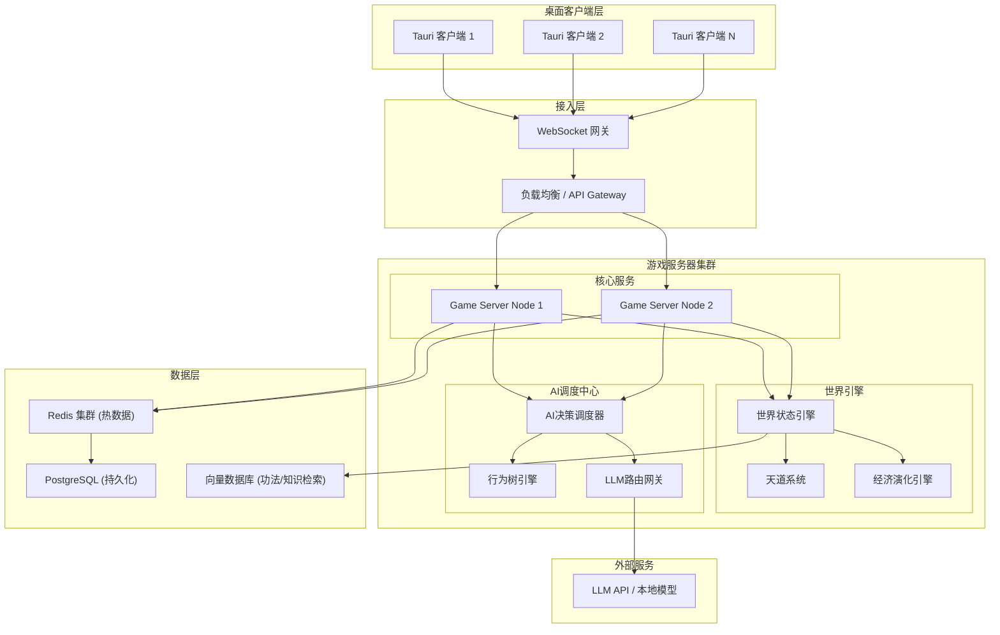
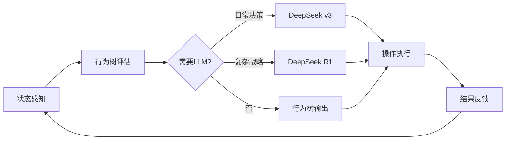

# 完全自主修仙第二世界 - 技术设计文档

Feature Name: autonomous-cultivation-npc
Updated: 2026-05-02

## Description

本项目是一个完全自主演化的多人在线文字MUD修仙世界，核心技术创新是NPC与现实玩家共享完全一致的操作接口，NPC通过混合AI系统（行为树 + LLM）自主决策，使得世界中每个实体都是自治个体。

世界特点：
- 无预设任务或剧情，所有行为由参与者自主决定
- 社会关系、经济体系、宗门势力完全自发演化
- 玩家/NPC可自创功法、炼丹配方、阵法
- 天道系统通过因果业力和天劫维持自然平衡

## Architecture



### 架构说明

| 层级 | 组件 | 职责 |
|------|------|------|
| 客户端 | Tauri + React | 桌面端界面，指令输入，世界信息渲染 |
| 接入层 | WebSocket 网关 | 连接管理，消息路由，会话维持 |
| 游戏服务器 | Go 微服务 | 核心游戏逻辑，操作验证，状态同步 |
| 世界引擎 | Go 服务 | 世界状态管理，天道判定，危机事件生成，**世界初始化** |
| AI调度 | Go 服务 | NPC决策调度，行为树执行，**第三方LLM API调用** |
| 数据层 | Redis + PostgreSQL + 向量库 | 热数据缓存，持久化存储，语义检索 |

**动态实体规模设计：**
- 服务器根据节点CPU/内存配置自动计算最大承载实体数
- 公式：`max_entities = (available_memory_mb / memory_per_entity) * cpu_factor`
- 当接近上限时，触发水平扩展或限制新NPC生成
- LLM API调用采用并发控制池，避免超过API速率限制

### 世界初始化引擎

```
WorldInitializer {
    load_template(template_name) -> WorldSeed
    generate_regions(seed) -> RegionGraph
    spawn_initial_npcs(count, distribution) -> list[Entity]
    place_resources(density, rarity_curve) -> ResourceMap
    establish_initial_factions() -> FactionGraph
    generate_world_lore() -> WorldHistory
    spawn_special_locations() -> SpecialLocations
}
```

**预置内容详细设计：**

1. **地图结构（区域层级）**
   ```
   世界根节点
   ├── 东荒域（主区域）
   │   ├── 青云镇（凡人城镇 - 新手起点）
   │   ├── 灵雾山脉（灵气山林 - 初级修炼地）
   │   ├── 黑风秘境（险地 - 中级探索）
   │   └── 落日沼泽（资源区 - 灵草/毒物）
   ├── 南岭域（主区域）
   │   ├── 赤炎城（修真城市）
   │   ├── 焚天谷（火属性灵地）
   │   └── 万兽山脉（妖兽聚集地）
   ├── 西漠域（主区域）
   │   ├── 黄沙古城（遗迹）
   │   └── 月牙绿洲（中立交易区）
   ├── 北原域（主区域）
   │   ├── 冰封神殿（高阶秘境）
   │   └── 雪原部落（散修聚落）
   └── 中州域（核心区域）
       ├── 天道城（世界中心）
       └── 天机阁（功法交易/传承地）
   ```

2. **灵气节点系统**
   - 灵气浓度分9品（1品最低，9品最高）
   - 每个区域有1-3个主要灵脉节点
   - 灵气浓度影响修炼效率和突破概率
   - 灵脉可被宗门占据或破坏

3. **初始NPC群体（50-100个）**
   - **修为分布**：
     - 炼气期：60%（30-60个）- 底层修士
     - 筑基期：25%（12-25个）- 中坚力量
     - 金丹期：10%（5-10个）- 区域强者
     - 元婴期：5%（2-5个）- 世界"锚点"，影响格局
   - **性格分布**：正道、中立、魔道、隐修等
   - **背景故事**：每个NPC有独特的出身、目标、恩怨关系
   - **初始行为倾向**：部分NPC已有初步势力或合作关系

4. **资源分布**
   - **灵草类**：不同品阶分布在不同灵气区域
   - **矿石类**：山脉、洞穴中分布
   - **妖兽**：各区域有不同等级妖兽，提供材料和威胁
   - **灵气泉眼**：稀有资源，可被占据

5. **初始宗门势力（2-3个）**
   - **青云宗**（正道）- 位于东荒域，收徒门槛低，理念"修身齐家"
   - **血煞殿**（魔道）- 位于南岭域，实力至上，理念"强者为尊"
   - **天机阁**（中立）- 位于中州域，功法交易、情报收集，理念"知识无价"

6. **世界历史与传说**
   - **上古大战**：万年前的正魔大战，留下多处遗迹
   - **陨落大能**：数位化神/渡劫大能陨落，遗留洞府和传承
   - **天道异变**：三百年前灵气潮汐，导致境界上限突破
   - **未解之谜**：若干隐藏线索供玩家/NPC探索发现

7. **基础规则设定**
   - 境界上限：初始设定为化神期（可通过世界演化突破）
   - 天劫规则：突破时有概率触发天劫
   - 死亡惩罚：身死道消，部分修为/物品掉落
   - 因果系统：善恶行为积累业力/功德

### LLM集成设计

**DeepSeek API 集成：**
- **模型选择**：
  - `deepseek-chat`（v3）：日常决策、对话生成（低延迟、高性价比）
  - `deepseek-reasoner`（R1）：复杂战略决策、功法自创验证（深度推理）
- **API兼容**：OpenAI兼容格式，可直接使用OpenAI SDK
- **成本控制**：NPC决策使用v3，关键剧情/复杂决策使用R1
- **速率限制**：DeepSeek限制600 RPM，需实现令牌桶限流

**模板匹配与LLM调用策略：**
- **核心原则**：优先使用预生成模板，仅在模板不匹配时调用LLM
- **模板库**：预生成常见行为模式、对话场景、决策树
- **匹配逻辑**：基于情境相似度匹配模板，相似度≥50%直接使用模板
- **LLM降级**：仅<50%相似度场景需要LLM实时生成

```
LLMProvider {
    provider: DeepSeekAPI
    models:
        daily: "deepseek-chat"        // 日常行为、对话
        reasoning: "deepseek-reasoner" // 复杂决策
    rate_limiter: TokenBucket(600/min)
    circuit_breaker: CircuitBreaker
    fallback: BehaviorTree
    
    // 模板匹配与LLM调用策略
    decide(context) -> Decision:
        // 1. 尝试模板匹配
        template = template_library.match(context, threshold=0.5)
        if template:
            metrics.record_template_hit()
            return template.instantiate(context)
        
        // 2. 相似度<50%，调用LLM
        try:
            response = provider.generate(
                model=context.priority == HIGH ? reasoning : daily,
                context=context,
                timeout=10s,
                max_tokens=500
            )
            // 3. 将LLM结果加入模板库（学习机制）
            template_library.add(context, response)
            return parse_decision(response)
        catch TimeoutError:
            metrics.record_fallback()
            return behavior_tree.decide(context)
}
```

**模板库结构：**
```
TemplateLibrary {
    behavior_templates: map<Pattern, Template>    // 行为模板（修炼、采集、探索等）
    dialogue_templates: map<Scenario, Template>   // 对话模板（交易、组队、冲突等）
    decision_templates: map<Situation, Template>  // 决策模板（结盟、背叛、突破等）
    
    match(context, threshold) -> Template:
        best_match = null
        best_score = 0
        
        for template in all_templates:
            score = calculate_similarity(context, template.pattern)
            if score > best_score:
                best_score = score
                best_match = template
        
        if best_score >= threshold:
            return best_match
        return null
}
```

**模板预生成内容：**
- **行为模板**：500+常见行为模式（修炼路线、采集策略、探索路径）
- **对话模板**：1000+对话场景（问候、交易、谈判、威胁、求助等）
- **决策模板**：200+决策树（结盟条件、背叛时机、突破策略）

**成本估算：**
- 无模板：每次NPC决策调用LLM，1000NPC × 60次/小时 = 60,000次/小时
- 有模板（≥50%命中率）：仅需30,000次LLM调用/小时，节省50%成本
- 实际命中率随模板库增长而提升，预计运营1个月后可达70%+

## Components and Interfaces

### 1. 统一操作接口 (Unified Action Interface)

所有实体（玩家和NPC）的操作都通过统一的命令接口执行：

```
Operation {
    actor_id: EntityID          // 执行者ID（玩家或NPC）
    action_type: ActionType     // 操作类型
    params: map<string, any>    // 操作参数
    timestamp: int64            // 时间戳
    signature: string           // 操作签名（用于回放）
}
```

**操作类型枚举：**

```
ActionType {
    CULTIVATE           // 修炼
    BREAKTHROUGH        // 突破境界
    COMBAT              // 战斗
    EXPLORE             // 探索
    GATHER              // 采集资源
    CRAFT               // 炼制（丹/器/阵）
    CREATE_METHOD       // 自创功法
    TRADE               // 交易
    FORM_SECT           // 创建宗门
    JOIN_SECT           // 加入宗门
    SEND_MESSAGE        // 发送消息
    CAST_SPELL          // 施法
    MEDITATE            // 打坐
    SLEEP               // 休息
    ...
}
```

### 2. 实体基类设计

```
Entity {
    id: EntityID
    entity_type: PLAYER | NPC
    name: string
    realm: CultivationRealm      // 境界
    attributes: Attributes       // 详细属性（50+项）
    inventory: Inventory         // 背包
    methods: list[Method]        // 功法列表
    karma: Karma                 // 因果业力
    position: WorldPosition      // 位置
    status: EntityStatus         // 状态
}
```

**Player 和 NPC 继承同一基类，区别仅在于：**
- Player: input_source = CLIENT
- NPC: input_source = AI_AGENT

### 2.1 详细属性系统（50+项）

```
Attributes {
    // ===== 基础属性 =====
    age: int                     // 年龄（岁）
    gender: enum                 // 性别
    appearance: int              // 容貌（1-100）
    charisma: int                // 魅力（影响社交）
    
    // ===== 修炼属性 =====
    qi: float                    // 气血值
    spiritual_power: float       // 灵力值
    divine_sense: float          // 神识强度
    comprehension: int           // 悟性（1-100）
    constitution: int            // 根骨（1-100）
    luck: int                    // 气运（1-100）
    cultivation_progress: float  // 修炼进度（0-100%）
    cultivation_method: int      // 当前修炼功法熟练度
    
    // ===== 战斗属性 =====
    attack_power: float          // 攻击力
    defense: float               // 防御力
    speed: float                 // 速度
    crit_rate: float             // 暴击率（%）
    crit_damage: float           // 暴击伤害（%）
    dodge_rate: float            // 闪避率（%）
    hit_rate: float              // 命中率（%）
    penetration: float           // 破甲值
    damage_reduction: float      // 伤害减免（%）
    
    // ===== 灵根系统 =====
    spiritual_roots: list[Root]  // 灵根列表（金木水火风雷冰光暗等）
    root_purity: int             // 灵根纯度（1-100）
    root_awakened: bool          // 是否觉醒隐藏灵根
    mutated_root: Root           // 变异灵根
    
    // ===== 心境属性 =====
    mental_stability: int        // 心境稳定度（0-100）
    obsession_count: int         // 执念数量
    dao_heart: int               // 道心强度（1-100）
    inner_demon_resistance: int  // 心魔抗性
    enlightenment: int           // 顿悟值
    
    // ===== 生活技能 =====
    alchemy_level: int           // 炼丹等级（1-10）
    artificing_level: int        // 炼器等级（1-10）
    formation_level: int         // 阵法等级（1-10）
    fire_control: int            // 火候控制（1-100）
    herb_knowledge: int          // 灵草辨识（1-100）
    mining_skill: int            // 采矿技能（1-100）
    talisman_skill: int          // 符箓技能（1-10）
    beast_taming: int            // 御兽技能（1-10）
    
    // ===== 声望与社交 =====
    reputation: int              // 声望值
    sect_contribution: int       // 宗门贡献
    faction_standings: map       // 各势力好感度
    relationship_count: int      // 关系网络数量
    mentor_id: EntityID          // 师父
    disciple_ids: list[EntityID] // 徒弟列表
    sworn_siblings: list[EntityID] // 结义兄弟
    enemies: list[EntityID]      // 仇敌列表
    lovers: list[EntityID]       // 道侣
    
    // ===== 因果业力 =====
    karma: int                   // 业力值
    merit: int                   // 功德值
    karmic_debt: int             // 因果债
    heavenly_mark: enum          // 天道标记（清白/微瑕/业重/恶贯/天怒）
    
    // ===== 寿命与状态 =====
    remaining_lifespan: int      // 剩余寿命（年）
    max_lifespan: int            // 寿命上限
    aging_penalty: float         // 衰老惩罚
    injuries: list[Injury]       // 伤势列表
    buffs: list[Buff]            // 增益状态
    debuffs: list[Debuff]        // 减益状态
    poison_level: int            // 中毒程度
    curse_level: int             // 诅咒程度
    
    // ===== 财富与资产 =====
    spirit_stones: SpiritStones  // 灵石资产
    property_value: int          // 总资产估值
    real_estate: list[Property]  // 房产（洞府、店铺等）
    business_income: int         // 商业收入
    
    // ===== 特殊属性 =====
    bloodline: string            // 血脉（凡人/妖族/魔族/仙族等）
    bloodline_purity: int        // 血脉纯度（1-100）
    physique: string             // 体质（如混沌体、先天道体等）
    physique_awakened: bool      // 体质是否觉醒
    destiny: int                 // 命格（隐藏属性）
    world_favor: int             // 世界眷顾度

    // ===== 法则属性 (Laws) =====
    laws: map<string, float>     // 法则感悟进度 (金木水火土风雷冰光暗时空生死等 0-100)
    law_resonance: int           // 法则共鸣度 (多法则融合度，影响复合法术威力)
    domain_power: float          // 领域强度 (化神后可展开法则领域)
    domain_range: float          // 领域范围 (米)
    law_suppression: float       // 法则压制力 (高阶法则对低阶的压制)
    
    // ===== 大道属性 (Dao) =====
    dao_seed_type: string        // 道种类型 (剑/丹/阵/兽/杀戮/毁灭/造化等)
    dao_seed_level: int          // 道种等级 (1-9 品)
    dao_seed_growth: float       // 道种成长度 (0-100%)
    dao_marks: int               // 道痕数量 (每 100 感悟凝聚 1 道，影响神通威力)
    dao_heart_comprehension: int // 大道感悟深度 (决定最终境界上限)
    destiny_path: string         // 命运轨迹 (命格具象化，如"逆天改命"、"顺天应人")
}
```

**属性分类说明：**

| 类别 | 属性数量 | 主要影响 |
|------|----------|----------|
| 基础属性 | 4项 | 社交、外观 |
| 修炼属性 | 8项 | 修炼效率、突破 |
| 战斗属性 | 10项 | 战斗胜负 |
| 灵根系统 | 4项 | 功法匹配、修炼速度 |
| 心境属性 | 5项 | 心魔、突破稳定度 |
| 生活技能 | 8项 | 炼丹、炼器、阵法等 |
| 声望社交 | 9项 | 人际关系、势力互动 |
| 因果业力 | 4项 | 天劫、机缘 |
| 寿命状态 | 9项 | 生死、伤病、增益 |
| 财富资产 | 4项 | 经济实力 |
| 特殊属性 | 6项 | 血脉、体质、命格 |

**总计：83 项核心属性**

### 2.2 功法详细属性系统（60+ 项）

功法不仅是修炼工具，更是 NPC/玩家实力构建的核心。每个功法包含以下属性：

```
CultivationMethod {
    // ===== 基础信息 =====
    id: UUID
    name: string               // 功法名称
    creator_id: UUID           // 创始人 ID
    origin_sect: string        // 起源宗门
    rank: string               // 品阶（天/地/玄/黄 x 上/中/下/极品，共 12 级）
    category: string           // 类别（主修功法/秘术/身法/神识/辅助/生活）
    element_affinity: string   // 属性倾向（金木水火土风雷冰光暗/无）
    description: text
    version: int
    
    // ===== 核心修炼加成 =====
    cultivation_speed_mult: float  // 修炼速度倍率（e.g. 1.5x）
    spiritual_power_cap_mult: float // 灵力上限倍率
    qi_cap_mult: float             // 气血上限倍率
    divine_sense_cap_mult: float   // 神识上限倍率
    lifespan_bonus: int            // 额外寿命加成（年）
    recovery_speed_mult: float     // 恢复速度倍率（气血/灵力回复）
    
    // ===== 战斗属性加成 =====
    attack_bonuses: map<string, float>   // 攻击加成 {"fire_damage": 1.2, "penetration": 0.5}
    defense_bonuses: map<string, float>  // 防御加成 {"magic_resist": 0.3, "damage_reduction": 0.1}
    utility_bonuses: map<string, float>  // 辅助加成 {"loot_rate": 0.1, "alchemy_success": 0.2}
    
    // ===== 特殊效果 =====
    passive_effects: list<string>      // 被动特效列表（如 "mana_shield", "life_steal", "reflect"）
    active_skills: list<Skill>         // 主动技能列表（功法自带招式）
    ultimate_skill: Skill              // 功法大成领悟的终极神通
    
    // ===== 法则与大道亲和 =====
    law_affinities: list<string>       // 亲和法则（修炼此功法加速对应法则感悟）
    law_comprehension_bonus: float     // 法则感悟倍率
    dao_compatibility: list<string>    // 亲和大道（如修"剑道"功法对剑修有益）
    
    // ===== 限制条件 =====
    required_roots: list<string>       // 必需灵根（如 ["fire", "metal"]）
    required_physique: list<string>    // 必需体质（如 ["pure_yang_body"]）
    realm_requirement: string          // 最低境界要求
    alignment_restriction: string      // 阵营限制（正/魔/中立/无）
    karma_threshold: int               // 业力阈值限制（超过此值无法修炼）
    gender_restriction: string         // 性别限制（男/女/无）
    
    // ===== 传承与演化 =====
    parent_method_id: UUID             // 衍生自哪个功法
    evolution_path: list<UUID>         // 可演化方向（后续升级版）
    transmission_mode: string          // 传承方式（玉简/口授/血脉/神念）
    can_modify: bool                   // 是否允许后人修改（True 为开源功法）
    complexity: int                    // 功法复杂度（影响学习难度和反噬风险）
}
```

**功法属性分类说明：**

| 类别 | 属性数量 | 主要影响 |
|------|----------|----------|
| 基础信息 | 9 项 | 品阶、来源、属性定位 |
| 修炼加成 | 6 项 | 核心修炼效率、寿命 |
| 战斗加成 | 12+ 项 | 攻防数值、特殊战斗能力 |
| 法则亲和 | 3 项 | 法则感悟速度、领域威力 |
| 限制条件 | 6 项 | 灵根、体质、阵营门槛 |
| 传承演化 | 6 项 | 功法来源、修改权限、演化分支 |

**功法总评属性：**
- `power_score`: int // 功法强度综合评分（由系统根据属性计算）
- `potential`: int   // 功法潜力值（影响后期演化上限）
- `popularity`: int  // 流行度（多少人学习）

### 3. NPC AI 决策管道



**NPC系统提示词模板（DeepSeek）：**

```
你是一位修仙者，以下是你的角色设定：
- 姓名：{name}
- 境界：{realm}
- 性格：{personality}
- 背景：{background_story}
- 当前目标：{current_goal}
- 所属势力：{sect}

你身处一个完全自主的修仙世界，所有行为由你自主决定。
你可以修炼、探索、战斗、交易、结盟、背叛、自创功法等。
请根据当前情境做出符合角色设定的决策。

当前情境：
{context}

请从以下操作中选择一项：
{available_actions}

输出格式：
{
  "action": "操作类型",
  "params": {...},
  "reasoning": "决策理由（100字以内）"
}
```

**决策周期：**
- 高频行为树：每 1-5 秒评估一次（修炼、移动、简单交互）
- 低频LLM决策：每 30-120 秒评估一次（复杂社交、战略决策）
- LLM超时降级：超过 10 秒未响应则使用行为树默认策略

### 3.5 功法自创系统（含成本约束）

**成本约束设计：**
- 自创功法需要消耗 **10000极品灵石**，用于覆盖DeepSeek R1推理成本
- 防止NPC频繁调用LLM自创功法导致API费用失控
- 只有达到一定财富积累的实体才能尝试自创

```
CreateMethod {
    validate(entity) -> ValidationResult:
        if entity.spirit_stones.premium_grade < 10000:
            return Error("自创功法需要10000极品灵石")
        if entity.realm < required_realm:
            return Error("境界不足，无法自创功法")
        if entity.comprehension < required_comprehension:
            return Error("悟性不足，无法自创功法")
        return Success
    
    execute(entity, method_data) -> MethodEntity:
        entity.spirit_stones.premium_grade -= 10000
        method = deepseek_reasoner.validate_and_generate(method_data)
        method.creator_id = entity.id
        method.save()
        return method
}
```

**功法验证流程（DeepSeek R1）：**
1. 检查功法逻辑自洽性（属性加成是否合理）
2. 验证境界要求与效果匹配度
3. 生成功法描述、修炼路径、瓶颈设定
4. 返回结构化功法数据存入数据库

### 4. 世界状态引擎

```
WorldState {
    epoch: int64                   // 世界纪元时间
    realms: map<string, RealmState> // 各区域状态
    sects: map<string, SectState>   // 各宗门状态
    economy: EconomyState          // 经济状态
    events: list[WorldEvent]       // 进行中的事件
    balance_metrics: BalanceMetrics // 平衡指标
}
```

### 5. 天道系统

```
HeavenlyDao {
    evaluate_karma(entity) -> KarmicLevel
    check_heavenly_tribulation(entity) -> TribulationResult
    spawn_world_crisis() -> WorldEvent
    balance_check() -> BalanceAction
}
```

**因果业力类型：**
- 杀戮业力：击杀其他实体
- 功德：救助、传承、贡献
- 因果纠缠：恩怨、契约、承诺

### 6. 极品灵石严格获取机制

**设计原则：**
- 极品灵石是系统级稀缺资源，用于控制DeepSeek R1 API调用成本
- 严禁通过常规交易、修炼、采集等方式获取
- 只有通过重大世界贡献或突破才能获得

```
PremiumSpiritStoneSystem {
    // 允许的获取途径（硬编码，不可通过游戏内操作绕过）
    allowed_sources: [
        "heavenly_tribulation_breakthrough",  // 化神期天劫突破
        "world_secret_discovery",             // 首次发现隐藏传说/秘境
        "method_creator_reward",              // 自创功法被3+实体学习
        "world_crisis_resolution"             // 世界危机事件平息
    ]
    
    grant(entity_id, source, amount) -> Result:
        if source not in allowed_sources:
            return Error("非法获取途径")
        
        // 防重复领取检查
        if source == "heavenly_tribulation_breakthrough":
            if entity.has_claimed_breakthrough_reward(realm="nascent_soul"):
                return Error("已领取过突破奖励")
        
        if source == "method_creator_reward":
            method = get_method_by_creator(entity_id)
            if method.unique_learners < 10:
                return Error("学习人数不足10人")
        
        entity.premium_spirit_stones += amount
        record_premium_grant(entity_id, source, amount)
        return Success
}
```

**获取途径详细说明：**

| 途径 | 奖励范围 | 触发条件 | 频率限制 |
|------|----------|----------|----------|
| 化神期天劫突破 | 1-3 | 成功渡劫化神 | 每角色1次 |
| 发现隐藏传说/秘境 | 0-1 | 首次探索发现（仅极稀有发现） | 每传说/秘境1次 |
| 自创功法被学习 | 5-10 | 10个不同实体学习 | 每功法1次 |
| 平息世界危机 | 1-5 | 对危机事件有决定性贡献 | 每次危机1次 |

**获取难度分析：**
- 要积累10000极品灵石，需要：
  - 约3333-10000次化神突破（几乎不可能单人完成）
  - 或1000-2000个自创功法被广泛学习
  - 或2000-10000次世界危机决定性贡献
- 这意味着功法自创是极少数大能才能触及的领域
- NPC需要通过漫长的世界演化和积累才有可能获得

**全服极品灵石总量控制：**
- 初始总量：0（系统不预发）
- 年化产出上限：根据服务器实体数量动态计算
  - 公式：`annual_max = entity_count * 3`（假设每实体每年最多化神突破1次得3颗）

### 6.5 灵石体系与兑换比例

**灵石等级与兑换比例：**

```
1 极品灵石 = 10^11 上品灵石
1 上品灵石 = 10^9  中品灵石
1 中品灵石 = 10^4  下品灵石

因此：
1 极品灵石 = 10^20 中品灵石 = 10^24 下品灵石
```

**数据模型设计（使用BIGINT存储）：**

```sql
-- 灵石资产表（分离存储各级灵石，避免精度问题）
CREATE TABLE entity_spirit_stones (
    entity_id UUID PRIMARY KEY REFERENCES entities(id),
    low_grade BIGINT DEFAULT 0,     -- 下品灵石 (最多 2^63-1 ≈ 9×10^18)
    medium_grade BIGINT DEFAULT 0,  -- 中品灵石
    high_grade BIGINT DEFAULT 0,    -- 上品灵石
    premium_grade BIGINT DEFAULT 0  -- 极品灵石
);
```

**设计说明：**
- 各级灵石独立存储，不自动兑换
- 玩家/NPC可通过交易接口手动兑换（需支付手续费）
- 功法自创消耗的是极品灵石（10000颗），不可用其他等级灵石替代
- 日常交易主要使用中品/下品灵石，上品灵石已属珍贵，极品灵石为战略级资源
- 当全服极品灵石总量超过阈值时，天道系统自动降低后续奖励

### 7. 经济演化引擎

```
EconomyEngine {
    track_transaction(tx) -> void
    get_market_price(item) -> PriceEstimate
    detect_manipulation() -> ManipulationAlert
    adjust_resource_spawn() -> ResourceAdjustment
}
```

**无系统定价，价格完全由交易历史推导：**
- 使用移动平均线 + 供需比计算参考价
- 不干预交易，仅记录和分析

### 8. 天道算法系统（Heavenly Dao Algorithm）

**设计原则：**
- 天道不是模糊规则，而是严格的数学算法
- 所有世界平衡、因果、天劫、资源刷新均由算法决定
- 算法参数公开透明，可通过游戏内观测推导
- 无任何人为干预，一切由算法自动执行

#### 8.1 因果业力算法

```
KarmaAlgorithm {
    // 因果业力计算公式
    calculate_karma_change(action, actor, target) -> KarmaDelta:
        base_karma = ACTION_KARMA_MAP[action.type]
        
        // 情境修正因子
        context_multiplier = 1.0
        context_multiplier *= (1.0 - actor.karma / KARMA_CAP)  // 业力越高，新增业力影响递减
        context_multiplier *= target.realm_factor()            // 目标境界越高，业力影响越大
        
        // 关系修正
        if actor.has_relationship(target, "mentor"):
            context_multiplier *= 2.0  // 背叛师门业力翻倍
        if actor.has_relationship(target, "enemy"):
            context_multiplier *= 0.5  // 仇杀业力减半
        
        return base_karma * context_multiplier
    
    // 业力衰减（自然消散）
    apply_karma_decay(entity, time_elapsed) -> NewKarma:
        decay_rate = 0.01  // 每小时1%衰减
        return entity.karma * exp(-decay_rate * time_elapsed)
}
```

**因果业力阈值表：**

| 业力范围 | 天道标记 | 影响 |
|----------|----------|------|
| 0-100 | 清白 | 无影响 |
| 100-500 | 微瑕 | 天劫概率+5% |
| 500-1000 | 业重 | 天劫概率+20%，交易受排斥 |
| 1000-5000 | 恶贯 | 天劫概率+50%，被天道标记 |
| 5000+ | 天怒 | 必遭天劫，资源刷新率-50% |

#### 8.2 天劫触发算法

```
HeavenlyTribulationAlgorithm {
    // 天劫触发概率计算
    calculate_tribulation_probability(entity) -> Probability:
        base_prob = BREAKTHROUGH_BASE_PROB[entity.target_realm]
        
        // 业力修正
        karma_factor = 1.0 + (entity.karma / 1000.0)
        
        // 功德修正（降低天劫概率）
        merit_factor = 1.0 - (entity.merit / 2000.0)
        merit_factor = max(merit_factor, 0.3)  // 最低30%基础概率
        
        // 气运修正
        luck_factor = 1.0 - (entity.luck / 100.0 * 0.2)
        
        // 综合计算
        prob = base_prob * karma_factor * merit_factor * luck_factor
        return clamp(prob, 0.1, 0.95)  // 限制在10%-95%之间
    
    // 天劫强度计算
    calculate_tribulation_strength(entity, prob) -> Strength:
        base_strength = REALM_BASE_STRENGTH[entity.target_realm]
        
        // 业力越高，天劫越强
        strength = base_strength * (1.0 + entity.karma / 500.0)
        
        // 近期渡劫者越多，天劫越强（天道平衡）
        recent_breakthroughs = get_recent_breakthrough_count(days=7)
        strength *= (1.0 + recent_breakthroughs * 0.1)
        
        return strength
}
```

#### 8.3 寿命与衰老算法

```
LifespanAlgorithm {
    // 境界寿命上限表
    REALM_LIFESPAN = {
        "mortal": 80,          // 凡人80年
        "qi_condensation": 120, // 炼气120年
        "foundation": 200,      // 筑基200年
        "golden_core": 500,     // 金丹500年
        "nascent_soul": 1000,   // 元婴1000年
        "soul_transformation": 3000, // 化神3000年
        "void_refinement": 5000,     // 炼虚5000年
        "integration": 8000,         // 合体8000年
        "mahayana": 10000,           // 大乘10000年
        "tribulation": 15000         // 渡劫15000年
    }
    
    // 当前剩余寿命计算
    calculate_remaining_lifespan(entity) -> Years:
        max_lifespan = REALM_LIFESPAN[entity.realm]
        current_age = get_current_age(entity)
        return max_lifespan - current_age
    
    // 衰老影响
    calculate_aging_penalty(entity) -> Penalty:
        remaining_pct = entity.remaining_lifespan / entity.max_lifespan
        
        if remaining_pct > 0.5:
            return 0  // 50%寿命以上无影响
        if remaining_pct > 0.2:
            return (0.5 - remaining_pct) * 0.3  // 修炼效率-3%~-9%
        if remaining_pct > 0.1:
            return (0.2 - remaining_pct) * 0.5 + 0.09  // 修炼效率-9%~-14%
        return 0.2  // 最后10%寿命，修炼效率-20%
    
    // 寿元耗尽处理
    handle_lifespan_depletion(entity) -> Result:
        if entity.remaining_lifespan <= 0:
            if entity.can_breakthrough():
                return TRIGGER_BREAKTHROUGH  // 触发突破尝试
            else:
                return ENTITY_DECEASE  // 身死道消
}
```

#### 8.4 修炼效率算法

```
CultivationEfficiencyAlgorithm {
    // 修炼效率基础公式
    calculate_cultivation_rate(entity) -> Rate:
        base_rate = entity.comprehension * 0.1
        
        // 灵气浓度修正
        spiritual_factor = entity.location.spiritual_density / 100.0
        
        // 功法匹配度修正（灵根与功法属性匹配）
        method_match = calculate_method_compatibility(entity, entity.active_method)
        
        // 境界修正（境界越高，修炼越慢）
        realm_penalty = 1.0 / (1.0 + entity.realm_level * 0.2)
        
        // 心境状态修正
        state_factor = get_mental_state_factor(entity)
        
        // 衰老修正
        aging_penalty = calculate_aging_penalty(entity)
        
        return base_rate * spiritual_factor * method_match * realm_penalty * state_factor * (1.0 - aging_penalty)
    
    // 灵根与功法匹配度
    calculate_method_compatibility(entity, method) -> Score:
        match_count = 0
        for root in entity.spiritual_roots:
            if root in method.required_roots:
                match_count += 1
        return match_count / max(len(method.required_roots), 1)
}
```

#### 8.5 突破成功率算法

```
BreakthroughAlgorithm {
    // 突破成功率计算
    calculate_breakthrough_success(entity) -> Probability:
        base_prob = BASE_BREAKTHROUGH_PROB[entity.target_realm]
        
        // 修为积累修正（修炼时间越长，成功率越高）
        accumulation_factor = min(1.5, 1.0 + entity.cultivation_time / required_time)
        
        // 功法品质修正
        method_quality = entity.active_method.quality / 100.0
        
        // 资源辅助修正（丹药、法宝等）
        resource_bonus = sum(item.breakthrough_bonus for item in entity.consumed_resources)
        
        // 心境修正
        mental_factor = entity.mental_stability / 100.0
        
        // 气运修正
        luck_factor = 1.0 + (entity.luck - 50) / 200.0
        
        prob = base_prob * accumulation_factor * method_quality * (1.0 + resource_bonus) * mental_factor * luck_factor
        return clamp(prob, 0.05, 0.8)  // 限制在5%-80%
    
    // 突破失败惩罚
    calculate_breakthrough_failure_penalty(entity) -> Penalty:
        realm_loss = entity.realm_level * 0.1  // 损失10%当前境界修为
        cooldown_time = 24 * entity.realm_level  // 冷却时间（小时）
        mental_damage = 20  // 心境损伤
        
        return {
            "cultivation_loss": realm_loss,
            "cooldown_hours": cooldown_time,
            "mental_damage": mental_damage,
            "injury_chance": 0.3  // 30%概率受伤
        }
}
```

#### 8.6 战斗伤害算法

```
CombatDamageAlgorithm {
    // 基础伤害计算
    calculate_damage(attacker, defender, skill) -> Damage:
        base_damage = attacker.attack_power * skill.multiplier
        
        // 境界压制
        realm_diff = attacker.realm_level - defender.realm_level
        realm_suppression = 1.0 + realm_diff * 0.15  // 每高1境界+15%伤害
        
        // 属性克制
        element_factor = calculate_element_interaction(attacker.element, defender.element)
        
        // 防御减免
        defense_reduction = defender.defense / (defender.defense + 100)
        
        // 功法加成
        method_bonus = 1.0 + attacker.active_method.damage_bonus
        
        raw_damage = base_damage * realm_suppression * element_factor * (1.0 - defense_reduction) * method_bonus
        
        // 暴击判定
        if random() < attacker.crit_rate:
            raw_damage *= attacker.crit_damage
        
        return raw_damage
    
    // 属性克制关系
    calculate_element_interaction(atk_element, def_element) -> Factor:
        INTERACTIONS = {
            ("fire", "metal"): 1.5,
            ("fire", "wood"): 1.3,
            ("water", "fire"): 1.5,
            ("wood", "earth"): 1.5,
            ("metal", "wood"): 1.5,
            ("earth", "water"): 1.5,
        }
        return INTERACTIONS.get((atk_element, def_element), 1.0)
    
    // 战斗结果判定
    resolve_combat(attacker, defender) -> Result:
        attacker_hp = attacker.max_hp
        defender_hp = defender.max_hp
        
        while attacker_hp > 0 and defender_hp > 0:
            damage = calculate_damage(attacker, defender, attacker.selected_skill)
            defender_hp -= damage
            if defender_hp <= 0:
                break
            
            damage = calculate_damage(defender, attacker, defender.selected_skill)
            attacker_hp -= damage
        
        return {
            "winner": attacker if defender_hp <= 0 else defender,
            "loser": defender if defender_hp <= 0 else attacker,
            "damage_dealt": {
                attacker.id: attacker.max_hp - attacker_hp,
                defender.id: defender.max_hp - defender_hp
            }
        }
}
```

#### 8.7 功法冲突与兼容算法

```
MethodCompatibilityAlgorithm {
    // 多功法同时修炼的兼容性
    calculate_method_conflict(entity, methods) -> ConflictScore:
        if len(methods) == 1:
            return 0  // 单功法无冲突
        
        conflict = 0
        for i, m1 in enumerate(methods):
            for m2 in methods[i+1:]:
                // 属性冲突检测
                if m1.element == opposite(m2.element):
                    conflict += 0.5
                // 功法理念冲突
                if m1.alignment != m2.alignment:
                    conflict += 0.3
                // 境界要求差异
                if abs(m1.realm_requirement - m2.realm_requirement) > 2:
                    conflict += 0.2
        
        return conflict / (len(methods) * (len(methods) - 1) / 2)
    
    // 功法反噬计算
    calculate_method_backlash(entity) -> Risk:
        conflict = calculate_method_conflict(entity, entity.active_methods)
        
        if conflict < 0.2:
            return 0  // 无风险
        if conflict < 0.5:
            return 0.1  // 10%反噬概率
        if conflict < 0.8:
            return 0.3  // 30%反噬概率
        return 0.6  // 60%反噬概率
}
```

#### 8.8 丹药炼制算法

```
AlchemyAlgorithm {
    // 炼丹成功率
    calculate_pill_success_rate(alchemist, recipe) -> Probability:
        base_prob = recipe.base_success_rate
        
        // 炼丹师等级修正
        skill_factor = alchemist.alchemy_level / recipe.required_level
        
        // 火候控制（炼丹技巧）
        control_factor = 0.5 + alchemist.fire_control * 0.5
        
        // 材料品质
        material_quality = average(recipe.materials.quality) / 100.0
        
        // 丹炉品质
        furnace_bonus = recipe.furnace.quality_bonus
        
        // 环境灵气
        spiritual_factor = alchemist.location.spiritual_density / 100.0
        
        prob = base_prob * skill_factor * control_factor * material_quality * (1.0 + furnace_bonus) * spiritual_factor
        return clamp(prob, 0.05, 0.95)
    
    // 丹药品阶生成
    generate_pill_quality(success_rate, base_quality) -> Quality:
        roll = random()
        if roll < success_rate * 0.1:
            return base_quality + 2  // 极品（10%概率）
        if roll < success_rate * 0.3:
            return base_quality + 1  // 上品
        if roll < success_rate:
            return base_quality      // 中品
        return base_quality - 1      // 下品（失败）
    
    // 炼丹失败后果
    handle_alchemy_failure(recipe) -> Consequence:
        if random() < 0.2:
            return "explosion"  // 20%概率炸炉
        if random() < 0.5:
            return "wasted_materials"  // 50%概率材料损毁
        return "failed_pill"  // 30%概率产出废丹
}
```

#### 8.9 法宝炼制算法

```
ArtifactForgingAlgorithm {
    // 炼器成功率
    calculate_forging_success_rate(artificer, blueprint) -> Probability:
        base_prob = blueprint.base_success_rate
        
        // 炼器师等级
        skill_factor = artificer.artificing_level / blueprint.required_level
        
        // 材料匹配度
        material_match = calculate_material_compatibility(blueprint)
        
        // 火焰品质
        fire_quality = artificer.flame_tier / 10.0
        
        // 阵法辅助
        formation_bonus = blueprint.supporting_formations * 0.05
        
        prob = base_prob * skill_factor * material_match * fire_quality * (1.0 + formation_bonus)
        return clamp(prob, 0.05, 0.9)
    
    // 法宝品阶生成
    generate_artifact_grade(success_rate, blueprint) -> Grade:
        roll = random()
        if roll < success_rate * 0.05:
            return "ancient"  // 古宝（5%概率）
        if roll < success_rate * 0.15:
            return "heaven"   // 天器
        if roll < success_rate * 0.4:
            return "earth"    // 地器
        if roll < success_rate:
            return "mortal"   // 凡器
        return "failed"       // 失败
}
```

#### 8.10 阵法效果算法

```
FormationAlgorithm {
    // 阵法威力计算
    calculate_formation_power(formation, caster) -> Power:
        base_power = formation.base_power
        
        // 阵法师等级
        skill_factor = caster.formation_level / formation.required_level
        
        // 阵眼品质
        eye_quality = formation.eye_item.quality / 100.0
        
        // 阵旗品质
        flag_quality = average(formation.flags.quality) / 100.0
        
        // 地势加成
        terrain_bonus = formation.terrain_bonus
        
        return base_power * skill_factor * eye_quality * flag_quality * (1.0 + terrain_bonus)
    
    // 破阵成功率
    calculate_break_formation_rate(breaker, formation) -> Probability:
        formation_power = calculate_formation_power(formation, formation.caster)
        breaker_power = breaker.formation_level * 100
        
        // 境界压制
        realm_diff = breaker.realm_level - formation.caster.realm_level
        
        prob = breaker_power / (formation_power + breaker_power) * (1.0 + realm_diff * 0.1)
        return clamp(prob, 0.05, 0.8)
}
```

#### 8.11 气运与机缘算法

```
FortuneAlgorithm {
    // 气运值计算
    calculate_fortune(entity) -> FortuneScore:
        base = entity.luck
        
        // 功德加成
        merit_bonus = entity.merit * 0.1
        
        // 业力减益
        karma_penalty = entity.karma * 0.05
        
        // 近期行为影响（最近7天）
        recent_actions = get_recent_actions(entity, days=7)
        action_bonus = calculate_action_fortune_bonus(recent_actions)
        
        return base + merit_bonus - karma_penalty + action_bonus
    
    // 机缘触发概率
    calculate_opportunity_rate(entity, location) -> Probability:
        fortune = calculate_fortune(entity)
        
        // 基础概率
        base_prob = 0.01  // 1%基础概率
        
        // 气运修正
        fortune_factor = 1.0 + fortune / 100.0
        
        // 地点灵气
        spiritual_factor = location.spiritual_density / 100.0
        
        // 探索活跃度
        exploration_factor = location.exploration_activity
        
        // 天道平衡修正
        balance_factor = get_world_balance_factor()
        
        return base_prob * fortune_factor * spiritual_factor * exploration_factor * balance_factor
}
```

#### 8.12 灵根觉醒算法

```
SpiritualRootAlgorithm {
    // 隐藏灵根觉醒概率
    calculate_awakening_rate(entity) -> Probability:
        base_prob = 0.001  // 0.1%基础概率
        
        // 修炼年限修正
        cultivation_years = entity.cultivation_time / 365
        year_factor = 1.0 + cultivation_years * 0.1
        
        // 突破经历修正
        breakthrough_count = entity.breakthrough_count
        breakthrough_factor = 1.0 + breakthrough_count * 0.2
        
        // 气运修正
        fortune_factor = 1.0 + entity.luck / 50.0
        
        return base_prob * year_factor * breakthrough_factor * fortune_factor
    
    // 变异灵根生成
    generate_mutated_root(original_roots) -> MutatedRoot:
        MUTATION_TABLE = {
            ("fire", "water"): "steam",
            ("fire", "metal"): "lightning",
            ("water", "earth"): "ice",
            ("wood", "fire"): "wind",
            ("metal", "earth"): "crystal",
        }
        return MUTATION_TABLE.get(tuple(sorted(original_roots)), None)
}
```

#### 8.13 灵气潮汐算法

```
SpiritualTideAlgorithm {
    // 灵气潮汐周期（天）
    TIDE_CYCLE = 365  // 一年一周期
    
    // 当前灵气潮位计算
    calculate_current_tide(day) -> TideLevel:
        cycle_day = day % TIDE_CYCLE
        
        // 正弦曲线模拟潮汐
        tide_value = sin(2 * PI * cycle_day / TIDE_CYCLE)
        
        // 潮汐阶段
        if tide_value > 0.5:
            return "rising"    // 涨潮
        if tide_value < -0.5:
            return "ebbing"    // 退潮
        return "stable"        // 平稳
    
    // 灵气浓度动态调整
    adjust_spiritual_density(region, tide_level) -> NewDensity:
        base_density = region.base_spiritual_density
        
        if tide_level == "rising":
            return base_density * 1.3  // 涨潮+30%
        if tide_level == "ebbing":
            return base_density * 0.7  // 退潮-30%
        return base_density  // 平稳
}
```

#### 8.14 妖兽生成算法

```
DemonBeastAlgorithm {
    // 妖兽生成率
    calculate_beast_spawn_rate(region) -> Rate:
        base_rate = region.danger_level * 10
        
        // 灵气浓度修正
        spiritual_factor = region.spiritual_density / 100.0
        
        // 人类活动压制
        human_activity = count_entities_in_region(region) / region.capacity
        human_suppression = 1.0 - human_activity * 0.5
        
        // 妖兽潮周期
        tide_factor = calculate_demon_beast_tide_factor()
        
        return base_rate * spiritual_factor * human_suppression * tide_factor
    
    // 妖兽等级分布
    generate_beast_level_distribution(region) -> Distribution:
        base_level = region.danger_level
        
        // 指数衰减分布
        distribution = {}
        for level in range(1, base_level + 5):
            prob = exp(-0.5 * (level - base_level))
            distribution[level] = prob
        
        return normalize(distribution)
}
```

#### 8.15 宗门气运算法

```
SectFortuneAlgorithm {
    // 宗门气运计算
    calculate_sect_fortune(sect) -> FortuneScore:
        // 弟子平均实力
        avg_power = average(member.combat_power for member in sect.members)
        
        // 传承历史
        history_bonus = sect.age_years * 0.01
        
        // 底蕴（藏经阁、宝库等）
        foundation_bonus = sect.facilities_score * 0.1
        
        // 声望
        reputation_bonus = sect.reputation / 1000.0
        
        // 天道评价
        heaven_evaluation = calculate_heavenly_evaluation(sect)
        
        return avg_power + history_bonus + foundation_bonus + reputation_bonus + heaven_evaluation
    
    // 宗门兴衰周期
    predict_sect_trajectory(sect) -> Trajectory:
        fortune = calculate_sect_fortune(sect)
        
        if fortune > 80:
            return "prospering"  // 兴盛期
        if fortune > 50:
            return "stable"      // 稳定期
        if fortune > 20:
            return "declining"   // 衰退期
        return "collapsing"      // 崩溃期
}
```

#### 8.16 世界平衡算法

```
WorldBalanceAlgorithm {
    // 世界生态健康度评估
    evaluate_world_health() -> HealthMetrics:
        metrics = {
            "power_distribution": gini_coefficient(entity_powers),  // 实力基尼系数
            "resource_circulation": tx_volume_24h / total_resources,  // 资源流通率
            "sect_diversity": sect_count / entity_count,              // 宗门多样性
            "karma_distribution": stddev(entity_karma)               // 业力分布标准差
        }
        return metrics
    
    // 平衡干预策略
    apply_balance_adjustment(metrics) -> Adjustment:
        // 实力差距过大时，增加弱者机缘
        if metrics.power_distribution > 0.7:
            spawn_opportunity_for_weak_entities()
        
        // 资源流通过低时，增加资源刷新
        if metrics.resource_circulation < 0.01:
            increase_resource_spawn_rate(1.5)
        
        // 宗门过于集中时，增加散修机缘
        if metrics.sect_diversity < 0.05:
            spawn_hermit_opportunities()
        
        // 业力分布极端时，触发天道清洗
        if metrics.karma_distribution > 500:
            trigger_heavenly_cleansing()
}
```

#### 8.17 资源刷新算法

```
ResourceSpawnAlgorithm {
    // 资源刷新率计算
    calculate_spawn_rate(resource_type, region) -> SpawnRate:
        base_rate = RESOURCE_BASE_RATES[resource_type]
        
        // 灵气浓度修正
        spiritual_factor = region.spiritual_density / 100.0
        
        // 采集压力修正（最近采集量越多，刷新越慢）
        recent_harvest = get_recent_harvest(resource_type, region, hours=24)
        pressure_factor = max(0.1, 1.0 - recent_harvest / base_rate * 10)
        
        // 世界平衡修正
        balance_factor = get_world_balance_factor()
        
        return base_rate * spiritual_factor * pressure_factor * balance_factor
    
    // 稀有资源出现概率
    calculate_rare_spawn_chance(region) -> Chance:
        base_chance = 0.001  // 0.1%基础概率
        
        // 灵气品阶修正
        tier_factor = region.spiritual_tier / 9.0
        
        // 探索活跃度修正
        exploration_factor = get_region_exploration_activity(region)
        
        return base_chance * tier_factor * exploration_factor
}
```

#### 8.18 交易税收算法

```
TradeTaxAlgorithm {
    // 天道税（每笔交易自动扣除）
    calculate_heavenly_tax(amount) -> Tax:
        base_rate = 0.01  // 1%基础税率
        
        // 金额越大，税率越高（累进税制）
        if amount > 1000000:
            rate = base_rate * 1.5
        elif amount > 100000:
            rate = base_rate * 1.2
        else:
            rate = base_rate
        
        return amount * rate
    
    // 宗门税（宗门成员在势力范围内交易）
    calculate_sect_tax(amount, sect) -> Tax:
        sect_rate = sect.tax_rate  // 宗门自定税率
        return amount * sect_rate
    
    // 总税收
    calculate_total_tax(amount, sect=None) -> Tax:
        heavenly = calculate_heavenly_tax(amount)
        sect_tax = calculate_sect_tax(amount, sect) if sect else 0
        return heavenly + sect_tax
}
```

#### 8.19 心魔入侵算法

```
InnerDemonAlgorithm {
    // 心魔触发概率
    calculate_inner_demon_rate(entity) -> Probability:
        base_prob = 0.001  // 0.1%基础概率（每日）
        
        // 心境稳定性修正
        mental_factor = (100 - entity.mental_stability) / 100.0
        
        // 业力修正
        karma_factor = 1.0 + entity.karma / 1000.0
        
        // 修炼压力修正（突破前后）
        breakthrough_stress = 1.0
        if entity.recently_attempted_breakthrough(days=7):
            breakthrough_stress = 2.0
        
        // 功法冲突修正
        conflict_factor = 1.0 + calculate_method_conflict(entity) * 2.0
        
        return base_prob * mental_factor * karma_factor * breakthrough_stress * conflict_factor
    
    // 心魔强度
    calculate_inner_demon_strength(entity) -> Strength:
        base_strength = entity.realm_level * 100
        
        // 执念修正
        obsession_bonus = entity.obsession_count * 50
        
        return base_strength + obsession_bonus
    
    // 心魔战胜效果
    handle_inner_demon_victory(entity) -> Effect:
        // 战胜心魔：心境提升，修为精进
        entity.mental_stability += 20
        entity.cultivation_progress += 0.1
        return "enlightenment"
    
    // 心魔战败效果
    handle_inner_demon_defeat(entity) -> Effect:
        // 败于心魔：修为倒退，可能走火入魔
        entity.cultivation_progress -= 0.2
        entity.mental_stability -= 30
        
        if random() < 0.3:
            return "qi_deviation"  // 30%走火入魔
        return "cultivation_regression"
}
```

#### 8.20 世界演化算法

```
WorldEvolutionAlgorithm {
    // 世界纪元推进
    advance_world_epoch() -> NewEpoch:
        current_epoch = get_current_epoch()
        
        // 检查是否满足纪元更替条件
        if meets_epoch_transition_criteria():
            new_epoch = generate_new_epoch(current_epoch)
            apply_epoch_changes(new_epoch)
            return new_epoch
        
        return current_epoch
    
    // 纪元更替条件
    meets_epoch_transition_criteria() -> Boolean:
        criteria = [
            count_entities_above_realm("nascent_soul") >= 10,  // 10个以上元婴
            world_age_years >= 1000,                            // 世界运行1000年
            major_conflict_count_100y >= 5                      // 百年内5次大战
        ]
        return all(criteria)
    
    // 新纪元生成
    generate_new_epoch(current_epoch) -> Epoch:
        // 灵气重置
        reset_spiritual_density()
        
        // 资源重新分布
        redistribute_resources()
        
        // 天道规则微调
        adjust_heavenly_rules()
        
        // 新秘境生成
        spawn_new_secret_realms()
        
        return new_epoch
}
```

#### 8.3 世界平衡算法

```
WorldBalanceAlgorithm {
    // 世界生态健康度评估
    evaluate_world_health() -> HealthMetrics:
        metrics = {
            "power_distribution": gini_coefficient(entity_powers),  // 实力基尼系数
            "resource_circulation": tx_volume_24h / total_resources,  // 资源流通率
            "sect_diversity": sect_count / entity_count,              // 宗门多样性
            "karma_distribution": stddev(entity_karma)               // 业力分布标准差
        }
        return metrics
    
    // 平衡干预策略
    apply_balance_adjustment(metrics) -> Adjustment:
        // 实力差距过大时，增加弱者机缘
        if metrics.power_distribution > 0.7:
            spawn_opportunity_for_weak_entities()
        
        // 资源流通过低时，增加资源刷新
        if metrics.resource_circulation < 0.01:
            increase_resource_spawn_rate(1.5)
        
        // 宗门过于集中时，增加散修机缘
        if metrics.sect_diversity < 0.05:
            spawn_hermit_opportunities()
        
        // 业力分布极端时，触发天道清洗
        if metrics.karma_distribution > 500:
            trigger_heavenly_cleansing()
}
```

#### 8.4 资源刷新算法

```
ResourceSpawnAlgorithm {
    // 资源刷新率计算
    calculate_spawn_rate(resource_type, region) -> SpawnRate:
        base_rate = RESOURCE_BASE_RATES[resource_type]
        
        // 灵气浓度修正
        spiritual_factor = region.spiritual_density / 100.0
        
        // 采集压力修正（最近采集量越多，刷新越慢）
        recent_harvest = get_recent_harvest(resource_type, region, hours=24)
        pressure_factor = max(0.1, 1.0 - recent_harvest / base_rate * 10)
        
        // 世界平衡修正
        balance_factor = get_world_balance_factor()
        
        return base_rate * spiritual_factor * pressure_factor * balance_factor
    
    // 稀有资源出现概率
    calculate_rare_spawn_chance(region) -> Chance:
        base_chance = 0.001  // 0.1%基础概率
        
        // 灵气品阶修正
        tier_factor = region.spiritual_tier / 9.0
        
        // 探索活跃度修正
        exploration_factor = get_region_exploration_activity(region)
        
        return base_chance * tier_factor * exploration_factor
}
```

#### 8.5 势力平衡算法

```
FactionBalanceAlgorithm {
    // 势力实力评估
    evaluate_faction_power(faction) -> PowerScore:
        member_power = sum(member.combat_power for member in faction.members)
        resource_control = sum(region.value for region in faction.territory)
        influence = count_allies(faction) - count_enemies(faction)
        
        return member_power * 0.4 + resource_control * 0.4 + influence * 0.2
    
    // 制衡策略生成
    generate_counterbalance(dominant_faction) -> Strategy:
        // 为弱势势力生成机缘
        weak_factions = get_factions_below_power_threshold(
            dominant_faction.power * 0.3
        )
        
        for faction in weak_factions:
            spawn_opportunity(
                type="ancient_inheritance",
                target=faction,
                power_boost=dominant_faction.power * 0.1
            )
        
        // 增加弱势势力区域资源刷新
        increase_resource_spawn_in_territory(weak_factions, multiplier=1.5)
}
```

## Data Models

### 1. 角色数据模型

```sql
-- 实体表
CREATE TABLE entities (
    id UUID PRIMARY KEY,
    entity_type VARCHAR(10) NOT NULL CHECK (entity_type IN ('player', 'npc')),
    name VARCHAR(50) UNIQUE NOT NULL,
    realm VARCHAR(30) NOT NULL DEFAULT 'mortal',
    spiritual_root JSONB NOT NULL,  -- 灵根属性
    created_at TIMESTAMP DEFAULT NOW(),
    last_active_at TIMESTAMP,
    is_online BOOLEAN DEFAULT FALSE
);

-- 属性表（71项属性，分多表存储）
CREATE TABLE entity_base_attributes (
    entity_id UUID PRIMARY KEY REFERENCES entities(id),
    age INT DEFAULT 16,
    gender VARCHAR(10),
    appearance INT DEFAULT 50,
    charisma INT DEFAULT 50,
    qi REAL DEFAULT 100,
    spiritual_power REAL DEFAULT 50,
    divine_sense REAL DEFAULT 10,
    comprehension INT DEFAULT 50,
    constitution INT DEFAULT 50,
    luck INT DEFAULT 50,
    cultivation_progress REAL DEFAULT 0,
    cultivation_method_proficiency REAL DEFAULT 0
);

-- 战斗属性表
CREATE TABLE entity_combat_attributes (
    entity_id UUID PRIMARY KEY REFERENCES entities(id),
    attack_power REAL DEFAULT 10,
    defense REAL DEFAULT 5,
    speed REAL DEFAULT 10,
    crit_rate REAL DEFAULT 5,
    crit_damage REAL DEFAULT 150,
    dodge_rate REAL DEFAULT 5,
    hit_rate REAL DEFAULT 95,
    penetration REAL DEFAULT 0,
    damage_reduction REAL DEFAULT 0
);

-- 灵根系统表
CREATE TABLE entity_spiritual_roots (
    entity_id UUID REFERENCES entities(id),
    root_type VARCHAR(20),  -- 金木水火风雷冰光暗等
    purity INT DEFAULT 50,
    is_awakened BOOLEAN DEFAULT FALSE,
    is_mutated BOOLEAN DEFAULT FALSE,
    PRIMARY KEY (entity_id, root_type)
);

-- 心境属性表
CREATE TABLE entity_mental_attributes (
    entity_id UUID PRIMARY KEY REFERENCES entities(id),
    mental_stability INT DEFAULT 80,
    obsession_count INT DEFAULT 0,
    dao_heart INT DEFAULT 50,
    inner_demon_resistance INT DEFAULT 50,
    enlightenment INT DEFAULT 0
);

-- 生活技能表
CREATE TABLE entity_life_skills (
    entity_id UUID REFERENCES entities(id),
    alchemy_level INT DEFAULT 0,
    artificing_level INT DEFAULT 0,
    formation_level INT DEFAULT 0,
    fire_control INT DEFAULT 0,
    herb_knowledge INT DEFAULT 0,
    mining_skill INT DEFAULT 0,
    talisman_skill INT DEFAULT 0,
    beast_taming INT DEFAULT 0,
    PRIMARY KEY (entity_id)
);

-- 声望与社交表
CREATE TABLE entity_social_attributes (
    entity_id UUID REFERENCES entities(id),
    reputation INT DEFAULT 0,
    sect_contribution INT DEFAULT 0,
    relationship_count INT DEFAULT 0,
    mentor_id UUID REFERENCES entities(id),
    disciple_ids UUID[],
    sworn_siblings UUID[],
    enemies UUID[],
    lovers UUID[],
    faction_standings JSONB DEFAULT '{}',
    PRIMARY KEY (entity_id)
);

-- 因果业力表
CREATE TABLE entity_karma_attributes (
    entity_id UUID PRIMARY KEY REFERENCES entities(id),
    karma INT DEFAULT 0,
    merit INT DEFAULT 0,
    karmic_debt INT DEFAULT 0,
    heavenly_mark VARCHAR(20) DEFAULT '清白'
);

-- 寿命与状态表
CREATE TABLE entity_lifespan_status (
    entity_id UUID PRIMARY KEY REFERENCES entities(id),
    remaining_lifespan INT DEFAULT 80,
    max_lifespan INT DEFAULT 80,
    aging_penalty REAL DEFAULT 0,
    injuries JSONB DEFAULT '[]',
    buffs JSONB DEFAULT '[]',
    debuffs JSONB DEFAULT '[]',
    poison_level INT DEFAULT 0,
    curse_level INT DEFAULT 0
);

-- 财富与资产表
CREATE TABLE entity_wealth_attributes (
    entity_id UUID PRIMARY KEY REFERENCES entities(id),
    property_value BIGINT DEFAULT 0,
    real_estate JSONB DEFAULT '[]',
    business_income BIGINT DEFAULT 0
);

-- 特殊属性表
CREATE TABLE entity_special_attributes (
    entity_id UUID PRIMARY KEY REFERENCES entities(id),
    bloodline VARCHAR(30) DEFAULT '凡人',
    bloodline_purity INT DEFAULT 0,
    physique VARCHAR(50) DEFAULT '凡体',
    physique_awakened BOOLEAN DEFAULT FALSE,
    destiny INT DEFAULT 50,
    world_favor INT DEFAULT 0
);

-- 法则感悟表
CREATE TABLE entity_law_attributes (
    entity_id UUID PRIMARY KEY REFERENCES entities(id),
    laws JSONB DEFAULT '{}',  -- {"metal": 20.5, "wood": 10.0}
    law_resonance INT DEFAULT 0,
    domain_power REAL DEFAULT 0,
    domain_range REAL DEFAULT 0,
    law_suppression REAL DEFAULT 0
);

-- 大道属性表
CREATE TABLE entity_dao_attributes (
    entity_id UUID PRIMARY KEY REFERENCES entities(id),
    dao_seed_type VARCHAR(30) DEFAULT '无',
    dao_seed_level INT DEFAULT 0,
    dao_seed_growth REAL DEFAULT 0,
    dao_marks INT DEFAULT 0,
    dao_heart_comprehension INT DEFAULT 0,
    destiny_path VARCHAR(50) DEFAULT '凡途'
);

-- 灵石资产表（独立存储各级灵石）
CREATE TABLE entity_spirit_stones (
    entity_id UUID PRIMARY KEY REFERENCES entities(id),
    low_grade BIGINT DEFAULT 0,     -- 下品灵石
    medium_grade BIGINT DEFAULT 0,  -- 中品灵石
    high_grade BIGINT DEFAULT 0,    -- 上品灵石
    premium_grade BIGINT DEFAULT 0  -- 极品灵石
);

-- 功法表
CREATE TABLE cultivation_methods (
    id UUID PRIMARY KEY,
    name VARCHAR(100) NOT NULL,
    creator_id UUID REFERENCES entities(id),
    origin_sect VARCHAR(100),
    rank VARCHAR(20),              -- 天地玄黄 x 上中下极品
    category VARCHAR(20),          -- 主修/秘术/身法/神识/辅助
    element_affinity VARCHAR(20),
    description TEXT,
    created_at TIMESTAMP DEFAULT NOW(),
    version INTEGER DEFAULT 1,
    
    -- 修炼加成
    cultivation_speed_mult REAL DEFAULT 1.0,
    spiritual_power_cap_mult REAL DEFAULT 1.0,
    qi_cap_mult REAL DEFAULT 1.0,
    divine_sense_cap_mult REAL DEFAULT 1.0,
    lifespan_bonus INT DEFAULT 0,
    recovery_speed_mult REAL DEFAULT 1.0,
    
    -- 战斗加成
    attack_bonuses JSONB DEFAULT '{}',
    defense_bonuses JSONB DEFAULT '{}',
    utility_bonuses JSONB DEFAULT '{}',
    passive_effects TEXT[],
    active_skills JSONB DEFAULT '[]',
    ultimate_skill JSONB,
    
    -- 法则亲和
    law_affinities TEXT[],
    law_comprehension_bonus REAL DEFAULT 1.0,
    dao_compatibility TEXT[],
    
    -- 限制条件
    required_roots TEXT[],
    required_physique TEXT[],
    realm_requirement VARCHAR(30),
    alignment_restriction VARCHAR(20),
    karma_threshold INT DEFAULT 0,
    gender_restriction VARCHAR(10) DEFAULT '无',
    
    -- 传承演化
    parent_method_id UUID REFERENCES cultivation_methods(id),
    evolution_path UUID[],
    transmission_mode VARCHAR(20) DEFAULT '玉简',
    can_modify BOOLEAN DEFAULT FALSE,
    complexity INT DEFAULT 1
);

-- 功法-实体关联
CREATE TABLE entity_methods (
    entity_id UUID REFERENCES entities(id),
    method_id UUID REFERENCES cultivation_methods(id),
    proficiency REAL DEFAULT 0,     -- 熟练度
    PRIMARY KEY (entity_id, method_id)
);
```

### 2. 世界状态数据模型

```sql
-- 区域表
CREATE TABLE world_regions (
    id UUID PRIMARY KEY,
    name VARCHAR(100) NOT NULL,
    parent_region_id UUID REFERENCES world_regions(id),
    spiritual_density REAL DEFAULT 0,  -- 灵气浓度
    spiritual_tier INTEGER DEFAULT 1,  -- 灵气品阶（1-9）
    danger_level INTEGER DEFAULT 0,    -- 危险等级
    resources JSONB,                    -- 资源分布
    rules JSONB,                        -- 区域规则（禁区等）
    description TEXT,                   -- 区域描述
    lore TEXT                           -- 区域传说/历史
);

-- 宗门表
CREATE TABLE sects (
    id UUID PRIMARY KEY,
    name VARCHAR(100) UNIQUE NOT NULL,
    founder_id UUID REFERENCES entities(id),
    philosophy TEXT,                    -- 宗门理念
    entry_requirements JSONB,           -- 入门条件
    territory JSONB,                    -- 势力范围
    rules JSONB,                        -- 宗门规则
    alignment VARCHAR(20),              -- 正道/魔道/中立
    created_at TIMESTAMP DEFAULT NOW()
);

-- 宗门成员表
CREATE TABLE sect_members (
    sect_id UUID REFERENCES sects(id),
    entity_id UUID REFERENCES entities(id),
    rank VARCHAR(30),                   -- 职位
    contribution REAL DEFAULT 0,        -- 贡献值
    joined_at TIMESTAMP DEFAULT NOW(),
    PRIMARY KEY (sect_id, entity_id)
);

-- 交易记录表
CREATE TABLE transactions (
    id UUID PRIMARY KEY,
    seller_id UUID REFERENCES entities(id),
    buyer_id UUID REFERENCES entities(id),
    item_id UUID,
    item_type VARCHAR(30),
    price REAL,
    currency VARCHAR(20) DEFAULT 'spirit_stone',
    created_at TIMESTAMP DEFAULT NOW()
);

-- 世界历史/传说表
CREATE TABLE world_lore (
    id UUID PRIMARY KEY,
    title VARCHAR(200) NOT NULL,
    category VARCHAR(30),               -- 大战/传说/遗迹/未解之谜
    content TEXT,                       -- 详细内容
    related_regions JSONB,              -- 关联区域
    related_entities JSONB,             -- 关联实体
    hints JSONB,                        -- 探索线索
    is_discovered BOOLEAN DEFAULT FALSE -- 是否已被发现
);

-- NPC关系网络表
CREATE TABLE npc_relationships (
    id UUID PRIMARY KEY,
    entity_a_id UUID REFERENCES entities(id),
    entity_b_id UUID REFERENCES entities(id),
    relationship_type VARCHAR(30),      -- 师徒/仇敌/盟友/恋人等
    strength REAL,                      -- 关系强度
    history TEXT,                       -- 关系历史
    created_at TIMESTAMP DEFAULT NOW()
);
```

### 3. NPC AI 数据模型

```sql
-- NPC人格配置
CREATE TABLE npc_personalities (
    npc_id UUID PRIMARY KEY REFERENCES entities(id),
    personality_type VARCHAR(30),      -- 性格类型
    moral_alignment VARCHAR(20),       -- 道德倾向
    ambition_level INTEGER,            -- 野心程度
    risk_tolerance REAL,               -- 风险承受度
    social_preference VARCHAR(20),     -- 社交偏好
    background_story TEXT,             -- 背景故事
    current_goal TEXT,                 -- 当前目标
    hidden_secrets JSONB,              -- 隐藏秘密
    llm_system_prompt TEXT,            -- DeepSeek系统提示词
    behavior_tree_config JSONB,        -- 行为树配置
    initial_actions JSONB              -- 初始行为模式
);

-- NPC决策日志
CREATE TABLE npc_decision_log (
    id UUID PRIMARY KEY,
    npc_id UUID REFERENCES entities(id),
    decision_type VARCHAR(30),
    context JSONB,                     -- 决策上下文
    action_taken JSONB,                -- 采取的行动
    reasoning TEXT,                    -- 决策推理（DeepSeek输出）
    model_used VARCHAR(20),            -- deepseek-chat / deepseek-reasoner
    source VARCHAR(10),                -- 'behavior_tree' | 'llm'
    token_cost REAL,                   -- API调用成本
    timestamp TIMESTAMP DEFAULT NOW()
);
```

## Correctness Properties

### 1. 操作一致性

**不变量：** 同一操作由玩家或NPC执行，系统验证逻辑完全相同。

```
forall op in Operations:
    validate(op, entity_type=PLAYER) == validate(op, entity_type=NPC)
```

### 2. 世界状态原子性

**不变量：** 每个操作执行后，世界状态保持一致性。

```
forall transaction:
    pre_state + transaction = post_state
    post_state satisfies all constraints
```

### 3. NPC决策可重现

**不变量：** 给定相同的种子和上下文，NPC行为树输出一致。

```
BehaviorTree.evaluate(context, seed) = deterministic_output
```

### 4. 因果系统无环

**不变量：** 因果业力计算不产生循环依赖。

```
karma_graph is a DAG (Directed Acyclic Graph)
```

### 5. 经济系统守恒

**不变量：** 交易系统遵循资源守恒（不考虑天道生成/销毁）。

```
sum(all_entities.resources) + sum(world.resources) = constant
```

## Error Handling

### 错误处理策略

| 错误类型 | 处理策略 | 用户/NPC反馈 |
|----------|----------|-------------|
| 操作验证失败 | 拒绝执行，返回错误码 | 玩家：提示信息；NPC：记录日志，重新决策 |
| LLM服务超时 | 降级到行为树 | 玩家：无感知；NPC：使用默认策略 |
| 数据库写入失败 | 重试3次，失败后回滚 | 记录错误日志，触发告警 |
| 服务器节点故障 | 自动故障转移 | 玩家：短暂断线重连；NPC：状态恢复 |
| 世界状态不一致 | 暂停相关操作，回滚到最近一致状态 | 管理员通知，自动修复 |

### 降级策略

```
LLM_Fallback_Chain:
    1. 主LLM API (如 OpenAI/Claude)
    2. 备用LLM API (如 本地部署模型)
    3. 行为树默认策略
    4. 随机/静默行为（最低降级）
```

## Test Strategy

### 测试层次

| 层次 | 测试类型 | 覆盖率目标 |
|------|----------|-----------|
| 单元测试 | 操作验证、属性计算、境界判断 | > 80% |
| 集成测试 | 玩家/NPC操作一致性、交易系统、同步机制 | > 70% |
| 系统测试 | 完整游戏流程、世界演化、NPC行为 | 关键路径100% |
| 压力测试 | 并发连接数、AI决策吞吐量 | 达到设计指标 |
| 混沌测试 | 节点故障、网络分区、数据恢复 | 关键场景 |

### 关键测试场景

1. **统一接口一致性测试**：相同操作分别由玩家和NPC执行，验证结果一致
2. **NPC长期行为测试**：NPC连续运行24小时，验证行为合理性和资源消耗
3. **世界演化测试**：模拟100个实体（50玩家+50NPC）运行一周，验证社会和经济演化
4. **天劫触发测试**：验证因果业力累积和天劫触发逻辑
5. **经济系统测试**：验证无干预情况下价格自发形成

### 测试工具

- 单元测试：Go `testing` 包 + `testify`
- 集成测试：`testcontainers` 启动PostgreSQL/Redis
- 压力测试：自定义Go并发测试工具
- AI行为验证：回放日志分析 + 人工抽查

## References

[^1]: (Tauri) - [Desktop App Framework](https://tauri.app/)
[^2]: (Go Goroutines) - [Go Concurrency Patterns](https://go.dev/blog/pipelines)
[^3]: (Behavior Trees) - [AI Game Programming](https://www.gamasutra.com/view/feature/130592/behavior_trees_for_ai_games.php)
[^4]: (WebSocket) - [RFC 6455](https://datatracker.ietf.org/doc/html/rfc6455)
[^5]: (DeepSeek API) - [DeepSeek开放平台](https://platform.deepseek.com/)
[^6]: (DeepSeek Pricing) - API定价：v3输入1元/百万tokens，R1输入4元/百万tokens
