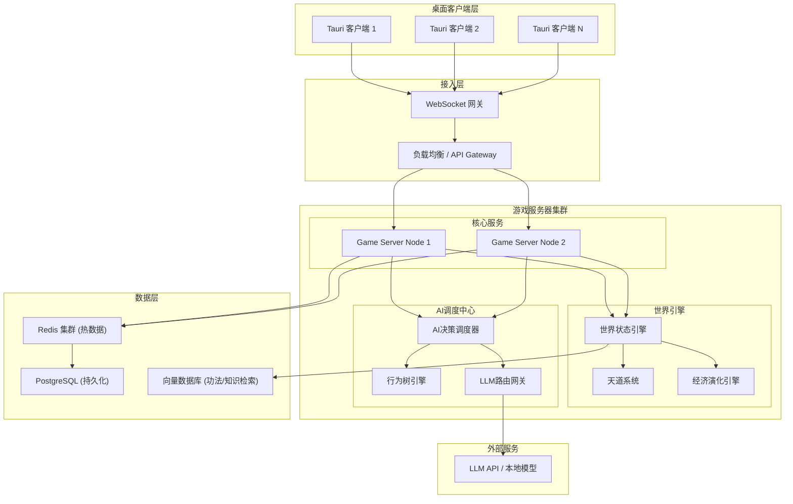
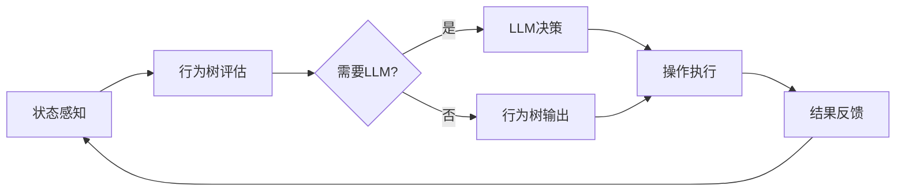

# 完全自主修仙第二世界 - 技术设计文档

Feature Name: autonomous-cultivation-npc
Updated: 2026-05-02

## Description

本项目是一个完全自主演化的多人在线文字MUD修仙世界，核心技术创新是NPC与现实玩家共享完全一致的操作接口，NPC通过混合AI系统（行为树 + LLM）自主决策，使得世界中每个实体都是自治个体。

世界特点：
- 无预设任务或剧情，所有行为由参与者自主决定
- 社会关系、经济体系、宗门势力完全自发演化
- 玩家/NPC可自创功法、炼丹配方、阵法
- 天道系统通过因果业力和天劫维持自然平衡

## Architecture



### 架构说明

| 层级 | 组件 | 职责 |
|------|------|------|
| 客户端 | Tauri + React | 桌面端界面，指令输入，世界信息渲染 |
| 接入层 | WebSocket 网关 | 连接管理，消息路由，会话维持 |
| 游戏服务器 | Go 微服务 | 核心游戏逻辑，操作验证，状态同步 |
| 世界引擎 | Go 服务 | 世界状态管理，天道判定，危机事件生成 |
| AI调度 | Go + Python | NPC决策调度，行为树执行，LLM调用 |
| 数据层 | Redis + PostgreSQL + 向量库 | 热数据缓存，持久化存储，语义检索 |

## Components and Interfaces

### 1. 统一操作接口 (Unified Action Interface)

所有实体（玩家和NPC）的操作都通过统一的命令接口执行：

```
Operation {
    actor_id: EntityID          // 执行者ID（玩家或NPC）
    action_type: ActionType     // 操作类型
    params: map<string, any>    // 操作参数
    timestamp: int64            // 时间戳
    signature: string           // 操作签名（用于回放）
}
```

**操作类型枚举：**

```
ActionType {
    CULTIVATE           // 修炼
    BREAKTHROUGH        // 突破境界
    COMBAT              // 战斗
    EXPLORE             // 探索
    GATHER              // 采集资源
    CRAFT               // 炼制（丹/器/阵）
    CREATE_METHOD       // 自创功法
    TRADE               // 交易
    FORM_SECT           // 创建宗门
    JOIN_SECT           // 加入宗门
    SEND_MESSAGE        // 发送消息
    CAST_SPELL          // 施法
    MEDITATE            // 打坐
    SLEEP               // 休息
    ...
}
```

### 2. 实体基类设计

```
Entity {
    id: EntityID
    entity_type: PLAYER | NPC
    name: string
    realm: CultivationRealm      // 境界
    attributes: Attributes       // 属性
    inventory: Inventory         // 背包
    methods: list[Method]        // 功法列表
    karma: Karma                 // 因果业力
    position: WorldPosition      // 位置
    status: EntityStatus         // 状态
}
```

**Player 和 NPC 继承同一基类，区别仅在于：**
- Player: input_source = CLIENT
- NPC: input_source = AI_AGENT

### 3. NPC AI 决策管道



**决策周期：**
- 高频行为树：每 1-5 秒评估一次（修炼、移动、简单交互）
- 低频LLM决策：每 30-120 秒评估一次（复杂社交、战略决策）
- LLM超时降级：超过 10 秒未响应则使用行为树默认策略

### 4. 世界状态引擎

```
WorldState {
    epoch: int64                   // 世界纪元时间
    realms: map<string, RealmState> // 各区域状态
    sects: map<string, SectState>   // 各宗门状态
    economy: EconomyState          // 经济状态
    events: list[WorldEvent]       // 进行中的事件
    balance_metrics: BalanceMetrics // 平衡指标
}
```

### 5. 天道系统

```
HeavenlyDao {
    evaluate_karma(entity) -> KarmicLevel
    check_heavenly_tribulation(entity) -> TribulationResult
    spawn_world_crisis() -> WorldEvent
    balance_check() -> BalanceAction
}
```

**因果业力类型：**
- 杀戮业力：击杀其他实体
- 功德：救助、传承、贡献
- 因果纠缠：恩怨、契约、承诺

### 6. 经济演化引擎

```
EconomyEngine {
    track_transaction(tx) -> void
    get_market_price(item) -> PriceEstimate
    detect_manipulation() -> ManipulationAlert
    adjust_resource_spawn() -> ResourceAdjustment
}
```

**无系统定价，价格完全由交易历史推导：**
- 使用移动平均线 + 供需比计算参考价
- 不干预交易，仅记录和分析

## Data Models

### 1. 角色数据模型

```sql
-- 实体表
CREATE TABLE entities (
    id UUID PRIMARY KEY,
    entity_type VARCHAR(10) NOT NULL CHECK (entity_type IN ('player', 'npc')),
    name VARCHAR(50) UNIQUE NOT NULL,
    realm VARCHAR(30) NOT NULL DEFAULT 'mortal',
    spiritual_root JSONB NOT NULL,  -- 灵根属性
    created_at TIMESTAMP DEFAULT NOW(),
    last_active_at TIMESTAMP,
    is_online BOOLEAN DEFAULT FALSE
);

-- 属性表
CREATE TABLE entity_attributes (
    entity_id UUID PRIMARY KEY REFERENCES entities(id),
    qi REAL DEFAULT 0,              -- 气血
    spiritual_power REAL DEFAULT 0, -- 灵力
    comprehension REAL DEFAULT 0,   -- 悟性
    constitution REAL DEFAULT 0,    -- 根骨
    luck REAL DEFAULT 0,            -- 气运
    cultivation_progress REAL DEFAULT 0  -- 修炼进度
);

-- 功法表
CREATE TABLE cultivation_methods (
    id UUID PRIMARY KEY,
    name VARCHAR(100) NOT NULL,
    creator_id UUID REFERENCES entities(id),
    realm_requirement VARCHAR(30),
    attributes JSONB,               -- 功法效果
    description TEXT,
    created_at TIMESTAMP DEFAULT NOW(),
    version INTEGER DEFAULT 1,
    parent_method_id UUID REFERENCES cultivation_methods(id)
);

-- 功法-实体关联
CREATE TABLE entity_methods (
    entity_id UUID REFERENCES entities(id),
    method_id UUID REFERENCES cultivation_methods(id),
    proficiency REAL DEFAULT 0,     -- 熟练度
    PRIMARY KEY (entity_id, method_id)
);
```

### 2. 世界状态数据模型

```sql
-- 区域表
CREATE TABLE world_regions (
    id UUID PRIMARY KEY,
    name VARCHAR(100) NOT NULL,
    parent_region_id UUID REFERENCES world_regions(id),
    spiritual_density REAL DEFAULT 0,  -- 灵气浓度
    danger_level INTEGER DEFAULT 0,    -- 危险等级
    resources JSONB,                    -- 资源分布
    rules JSONB                         -- 区域规则（禁区等）
);

-- 宗门表
CREATE TABLE sects (
    id UUID PRIMARY KEY,
    name VARCHAR(100) UNIQUE NOT NULL,
    founder_id UUID REFERENCES entities(id),
    philosophy TEXT,                    -- 宗门理念
    entry_requirements JSONB,           -- 入门条件
    territory JSONB,                    -- 势力范围
    rules JSONB,                        -- 宗门规则
    created_at TIMESTAMP DEFAULT NOW()
);

-- 宗门成员表
CREATE TABLE sect_members (
    sect_id UUID REFERENCES sects(id),
    entity_id UUID REFERENCES entities(id),
    rank VARCHAR(30),                   -- 职位
    contribution REAL DEFAULT 0,        -- 贡献值
    joined_at TIMESTAMP DEFAULT NOW(),
    PRIMARY KEY (sect_id, entity_id)
);

-- 交易记录表
CREATE TABLE transactions (
    id UUID PRIMARY KEY,
    seller_id UUID REFERENCES entities(id),
    buyer_id UUID REFERENCES entities(id),
    item_id UUID,
    item_type VARCHAR(30),
    price REAL,
    currency VARCHAR(20) DEFAULT 'spirit_stone',
    created_at TIMESTAMP DEFAULT NOW()
);
```

### 3. NPC AI 数据模型

```sql
-- NPC人格配置
CREATE TABLE npc_personalities (
    npc_id UUID PRIMARY KEY REFERENCES entities(id),
    personality_type VARCHAR(30),      -- 性格类型
    moral_alignment VARCHAR(20),       -- 道德倾向
    ambition_level INTEGER,            -- 野心程度
    risk_tolerance REAL,               -- 风险承受度
    social_preference VARCHAR(20),     -- 社交偏好
    background_story TEXT,             -- 背景故事
    llm_system_prompt TEXT,            -- LLM系统提示词
    behavior_tree_config JSONB         -- 行为树配置
);

-- NPC决策日志
CREATE TABLE npc_decision_log (
    id UUID PRIMARY KEY,
    npc_id UUID REFERENCES entities(id),
    decision_type VARCHAR(30),
    context JSONB,                     -- 决策上下文
    action_taken JSONB,                -- 采取的行动
    reasoning TEXT,                    -- 决策推理（LLM输出）
    source VARCHAR(10),                -- 'behavior_tree' | 'llm'
    timestamp TIMESTAMP DEFAULT NOW()
);
```

## Correctness Properties

### 1. 操作一致性

**不变量：** 同一操作由玩家或NPC执行，系统验证逻辑完全相同。

```
forall op in Operations:
    validate(op, entity_type=PLAYER) == validate(op, entity_type=NPC)
```

### 2. 世界状态原子性

**不变量：** 每个操作执行后，世界状态保持一致性。

```
forall transaction:
    pre_state + transaction = post_state
    post_state satisfies all constraints
```

### 3. NPC决策可重现

**不变量：** 给定相同的种子和上下文，NPC行为树输出一致。

```
BehaviorTree.evaluate(context, seed) = deterministic_output
```

### 4. 因果系统无环

**不变量：** 因果业力计算不产生循环依赖。

```
karma_graph is a DAG (Directed Acyclic Graph)
```

### 5. 经济系统守恒

**不变量：** 交易系统遵循资源守恒（不考虑天道生成/销毁）。

```
sum(all_entities.resources) + sum(world.resources) = constant
```

## Error Handling

### 错误处理策略

| 错误类型 | 处理策略 | 用户/NPC反馈 |
|----------|----------|-------------|
| 操作验证失败 | 拒绝执行，返回错误码 | 玩家：提示信息；NPC：记录日志，重新决策 |
| LLM服务超时 | 降级到行为树 | 玩家：无感知；NPC：使用默认策略 |
| 数据库写入失败 | 重试3次，失败后回滚 | 记录错误日志，触发告警 |
| 服务器节点故障 | 自动故障转移 | 玩家：短暂断线重连；NPC：状态恢复 |
| 世界状态不一致 | 暂停相关操作，回滚到最近一致状态 | 管理员通知，自动修复 |

### 降级策略

```
LLM_Fallback_Chain:
    1. 主LLM API (如 OpenAI/Claude)
    2. 备用LLM API (如 本地部署模型)
    3. 行为树默认策略
    4. 随机/静默行为（最低降级）
```

## Test Strategy

### 测试层次

| 层次 | 测试类型 | 覆盖率目标 |
|------|----------|-----------|
| 单元测试 | 操作验证、属性计算、境界判断 | > 80% |
| 集成测试 | 玩家/NPC操作一致性、交易系统、同步机制 | > 70% |
| 系统测试 | 完整游戏流程、世界演化、NPC行为 | 关键路径100% |
| 压力测试 | 并发连接数、AI决策吞吐量 | 达到设计指标 |
| 混沌测试 | 节点故障、网络分区、数据恢复 | 关键场景 |

### 关键测试场景

1. **统一接口一致性测试**：相同操作分别由玩家和NPC执行，验证结果一致
2. **NPC长期行为测试**：NPC连续运行24小时，验证行为合理性和资源消耗
3. **世界演化测试**：模拟100个实体（50玩家+50NPC）运行一周，验证社会和经济演化
4. **天劫触发测试**：验证因果业力累积和天劫触发逻辑
5. **经济系统测试**：验证无干预情况下价格自发形成

### 测试工具

- 单元测试：Go `testing` 包 + `testify`
- 集成测试：`testcontainers` 启动PostgreSQL/Redis
- 压力测试：自定义Go并发测试工具
- AI行为验证：回放日志分析 + 人工抽查

## References

[^1]: (Tauri) - [Desktop App Framework](https://tauri.app/)
[^2]: (Go Goroutines) - [Go Concurrency Patterns](https://go.dev/blog/pipelines)
[^3]: (Behavior Trees) - [AI Game Programming](https://www.gamasutra.com/view/feature/130592/behavior_trees_for_ai_games.php)
[^4]: (WebSocket) - [RFC 6455](https://datatracker.ietf.org/doc/html/rfc6455)
